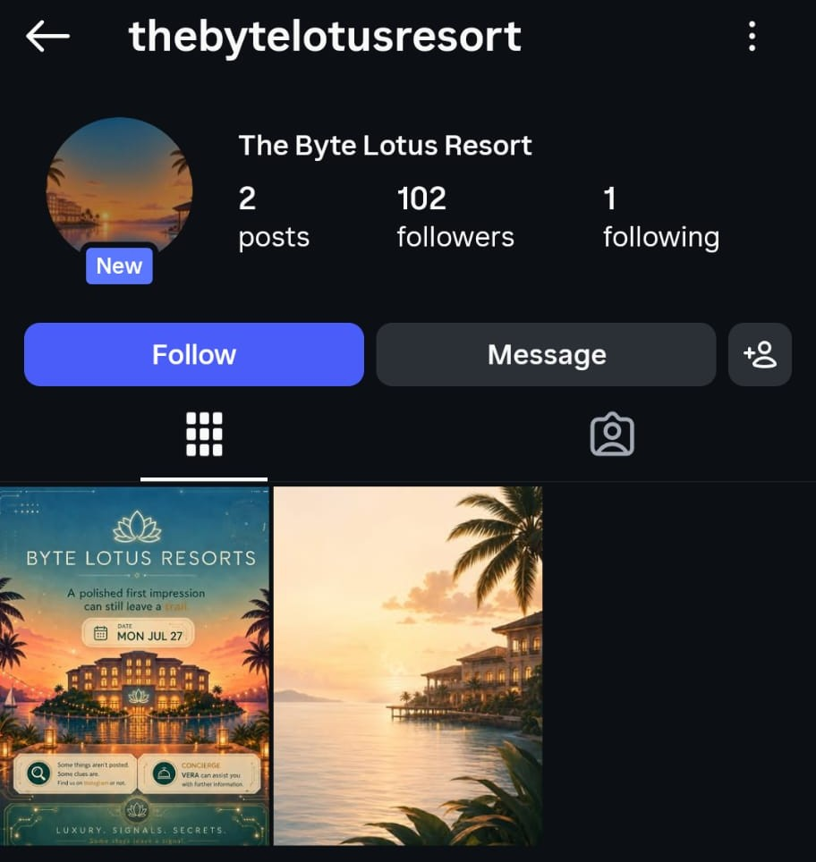
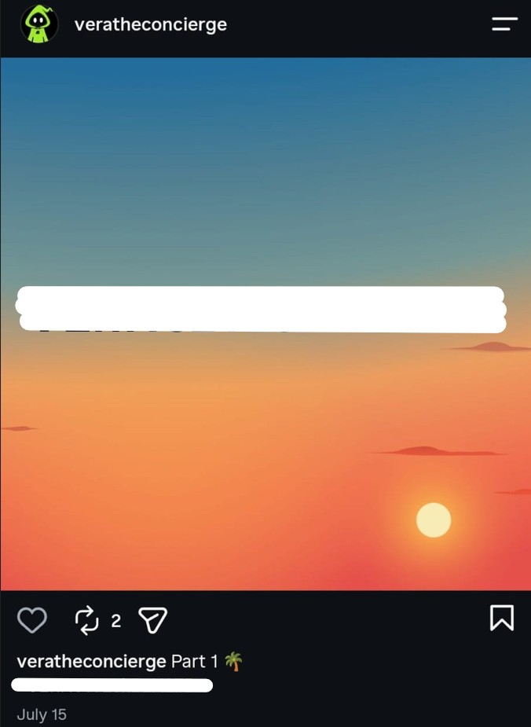
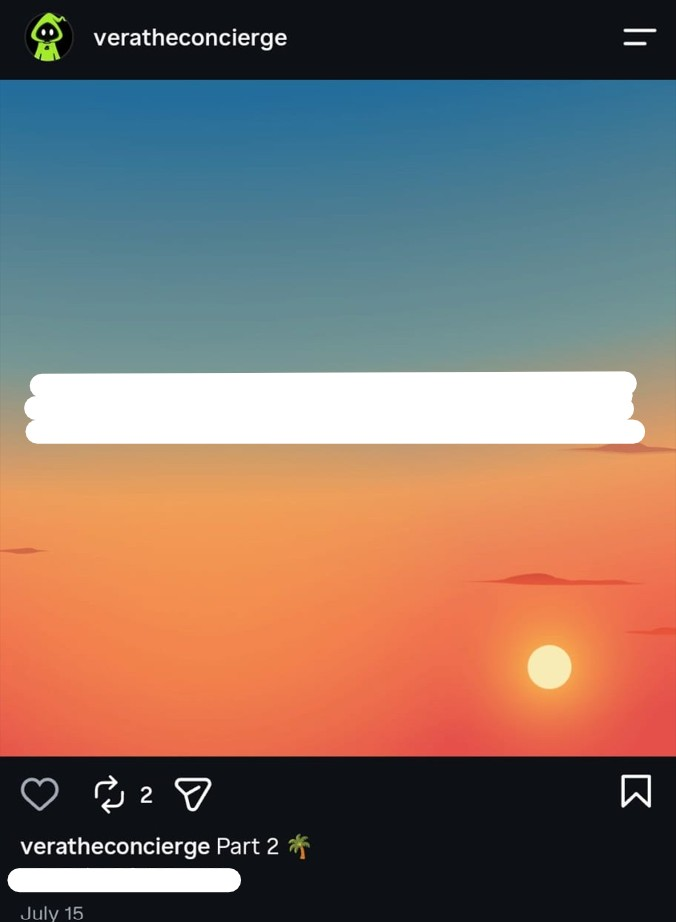
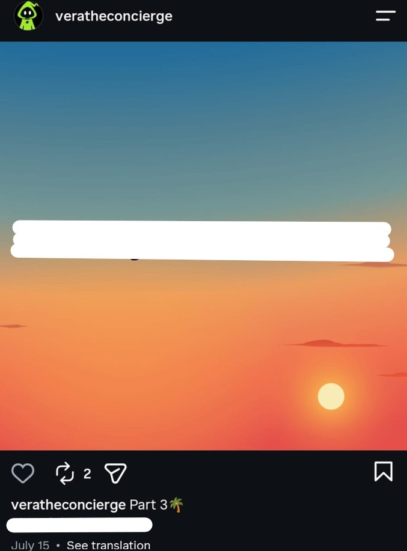
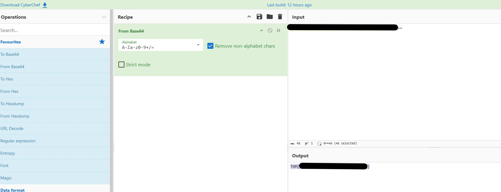

# Hacker Holidays - The Brochure

**Room:** Warm-up Room: The Brochure  
**Room URL:** https://tryhackme.com/room/hh-thebrochure-081f3e36

## Introduction

This challenge provided a practical introduction to using OSINT (Open-Source Intelligence) techniques to uncover hidden information from publicly available sources.

## Task 1 - Hacker Holidays Storyline: Act 0 - Recon

Task 1 introduced the reconnaissance stage of the challenge. The scenario indicated that I had not yet arrived at the property and was conducting preliminary research using publicly available information.

I reviewed the provided material to identify names, services, social media references, and other clues that could support further OSINT investigation.

## Task 2 - Hacker Holidays: Day 0

I downloaded the task file provided in Task 2. It was a `.png` image containing a brochure for the Byte Lotus Resort.

After carefully reviewing the brochure, I identified two important clues:

1. The statement, **“Some things aren’t posted. Some clues are. Find us on Instagram or not,”** suggested that the resort might have an Instagram account containing additional information.
2. The brochure introduced **VERA** as the resort’s concierge. This indicated that VERA could be connected to the resort’s online presence and might provide another lead for the investigation.

Based on the first clue, I searched Instagram for **“Byte Lotus Resort”** and found a profile with the username **`@thebytelotusresort`**. The profile contained only one post, which also appeared to be an AI-generated image.

To continue the investigation, I reviewed the account’s following list. The resort was following only one account: **VERA**, using the Instagram username **`@veratheconcierge`**.

I opened VERA’s profile and examined the three publicly available posts. The flag was divided across three separate posts and encoded using Base64.

I combined the encoded fragments in the correct order and used CyberChef to decode the Base64 value, which revealed the flag required to complete the task.

