# TryHackMe Hacker Holidays - Day 10

**Room:** The Hollow Shell

**Room URL:** https://tryhackme.com/room/hh-thehollowshell-ddb582ac

## Introduction

This challenge focused on service enumeration, hidden HTTP service discovery, credential exposure in page source, arbitrary file upload behavior analysis, and a zip slip vulnerability leading to remote code execution via automation hooks and capture the flag.

## Task 1 - Hacker Holidays: Day 10

After starting the machine, I connected to the lab network from Kali Linux using OpenVPN. I first verified that the target system was reachable by sending ICMP echo requests.

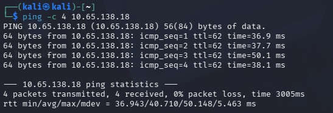

I accessed the webpage at the URL given in the room, `http://<target_IP>`, but it returned "Unable to connect".

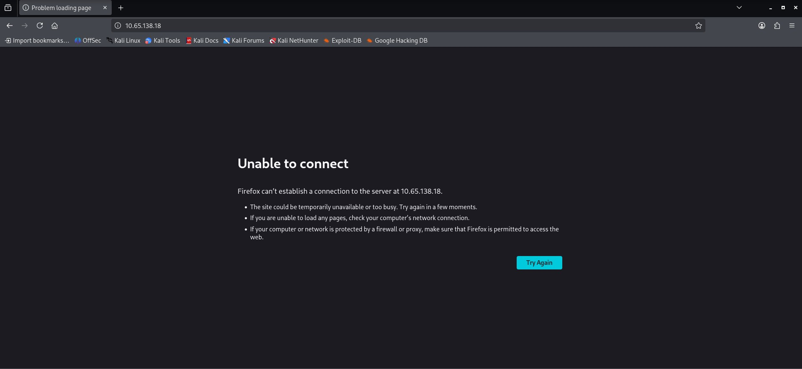

I then used Nmap to scan the target machine with `nmap -sV <target_IP>`. The scan results showed two open ports: port 22 (SSH) and port 5000 (HTTP). I didn't have credentials for SSH at this point, so it wasn't immediately useful. Port 5000, however, was running an HTTP service identified as Gunicorn, a Python server, which stood out as worth investigating further.

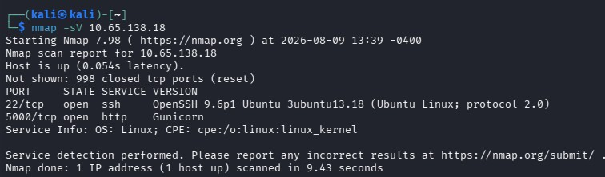

Next, I tried accessing the same target on port 5000, `http://<target_IP>:5000`, and was able to reach a webpage titled "BYTE LOTUS".

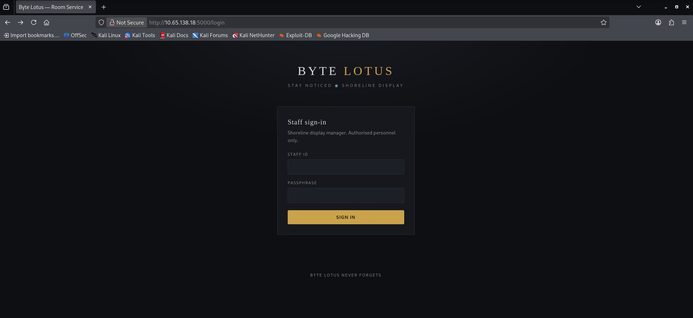

I reviewed the page source and found login credentials embedded in it. Using those credentials to log in worked, and I landed on a "Room Service" page.

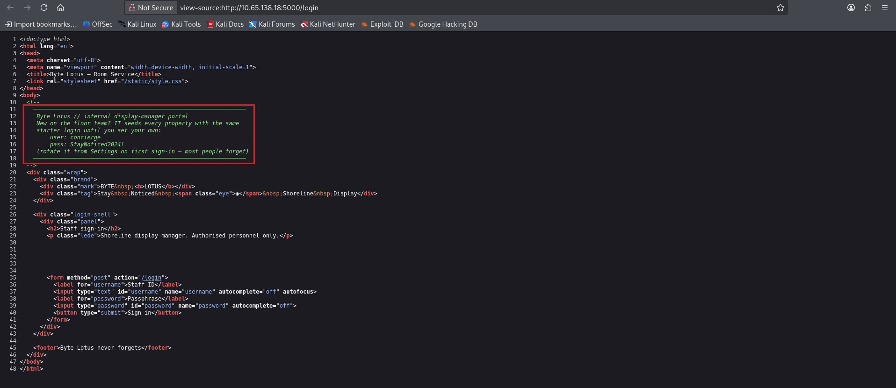

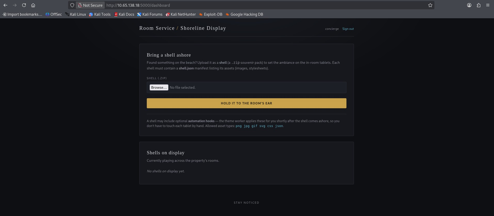

Based on the information on the page, the upload field expected a zip file containing a `shell.json` file as well as image files. To understand the application's behavior, I created a `shell.json` and a `test.png` file and zipped both into an archive named `shell.zip`.

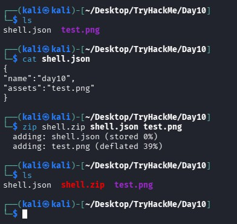

I uploaded `shell.zip` using the browse button and clicked the "HOLD IT TO THE ROOM'S EAR" button. This returned an error: "Shell rejected: 'assets' must be a list". I updated `shell.json` so that `assets` was a list, and re-uploaded the zip.

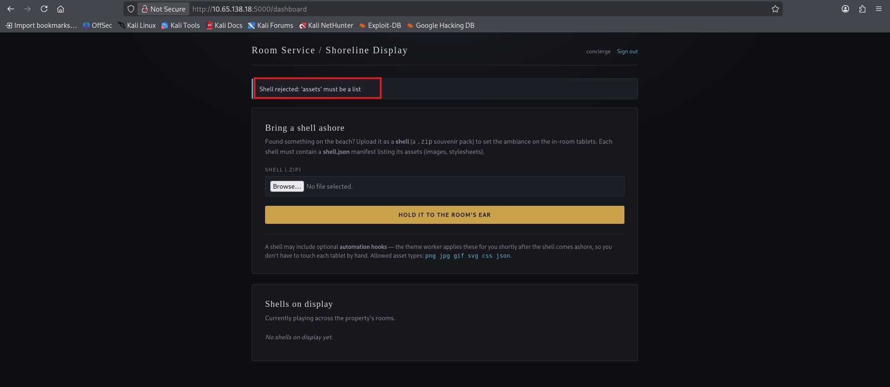

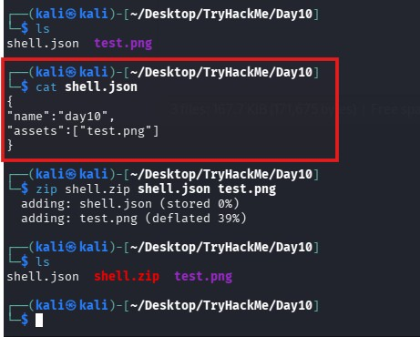

This time it worked. The application displayed a banner reading "Stored at shells/68a208569b21/", and at the bottom it showed the same name I had set under `"name"` in `shell.json`.

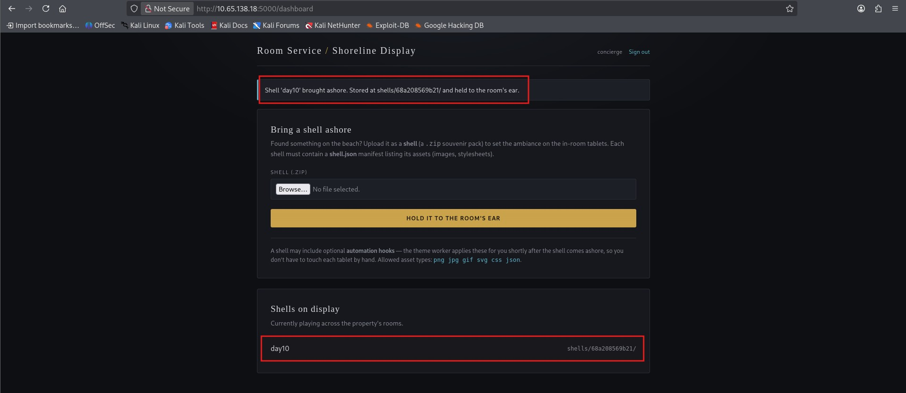

I then browsed to the path shown in the banner and was able to directly access both `shell.json` and `test.png`. This confirmed the application's behavior: it takes the uploaded zip file, reads `shell.json` to determine the display name for the shell, and places the image(s) from the zip into a `shells/<random_id>/` path.

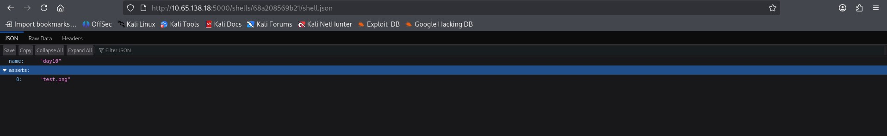

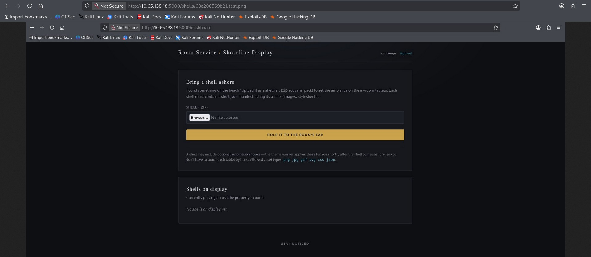

The dashboard also noted that "a shell may include optional automation hooks", meaning a Python script placed in a `hooks` directory would be executed automatically. This pointed toward a zip slip vulnerability (see: https://github.com/snyk/zip-slip-vulnerability), where a maliciously crafted archive path could be used to write and later execute a file outside the intended extraction directory, resulting in a reverse shell.

To exploit this, I created a Python file to achieve remote code execution as the application was running on `Gunicron` python server. I used https://www.revshells.com/ to generate the reverse shell payload, selecting the appropriate attacker IP, port number, target OS, and Python version.

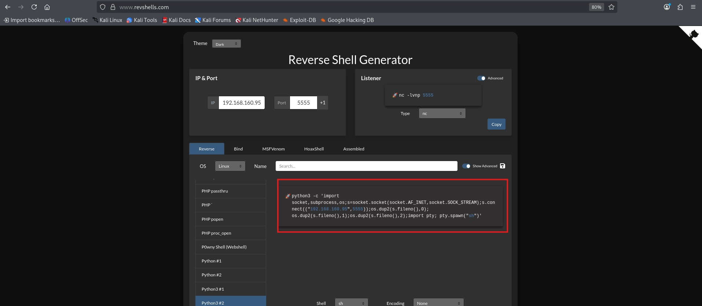

I ran the generated Python file with `python3 day10.py`, which produced a zip file named `day10.zip` containing the malicious hook.

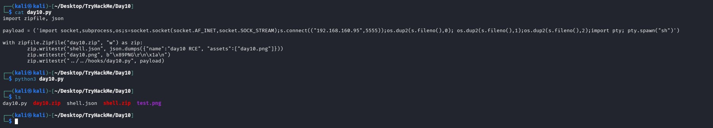

Before uploading `day10.zip`, I started a netcat listener on port 5555 in a separate terminal using `nc -lvnp 5555`.

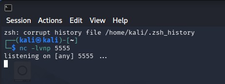

I then uploaded `day10.zip`, and the upload succeeded, showing the same banner message as before. At the same time, I received a reverse shell connection in my listening terminal.

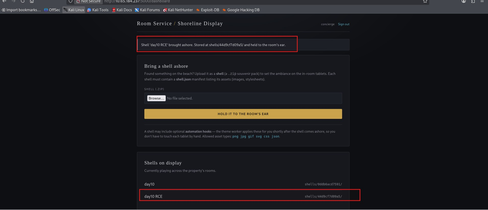

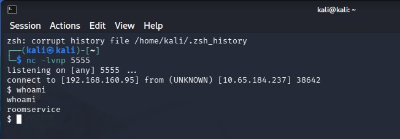

I navigated to the home folder and then into the `roomservice` directory, which contained a file named `flag.txt`, revealing the flag.

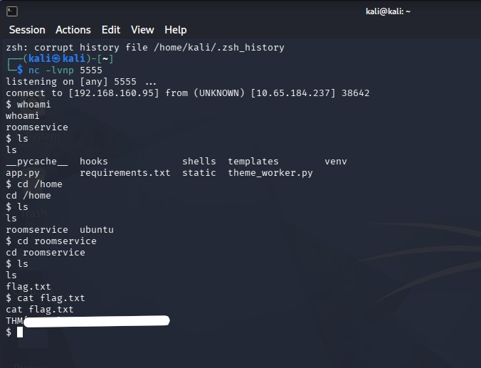
