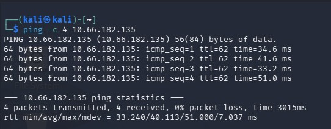
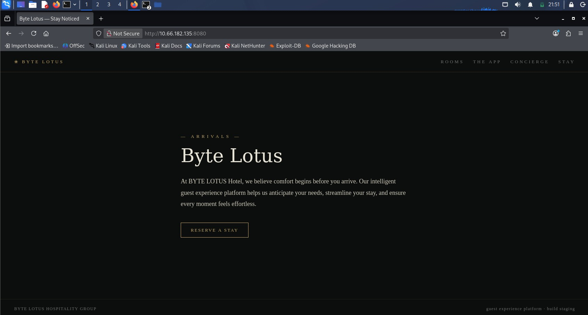
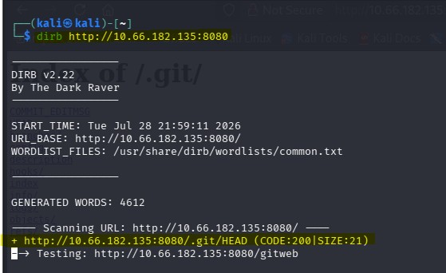
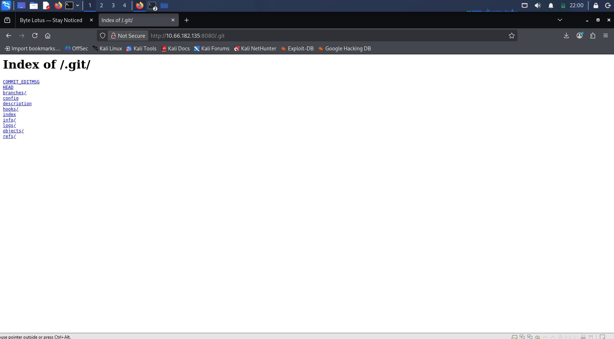
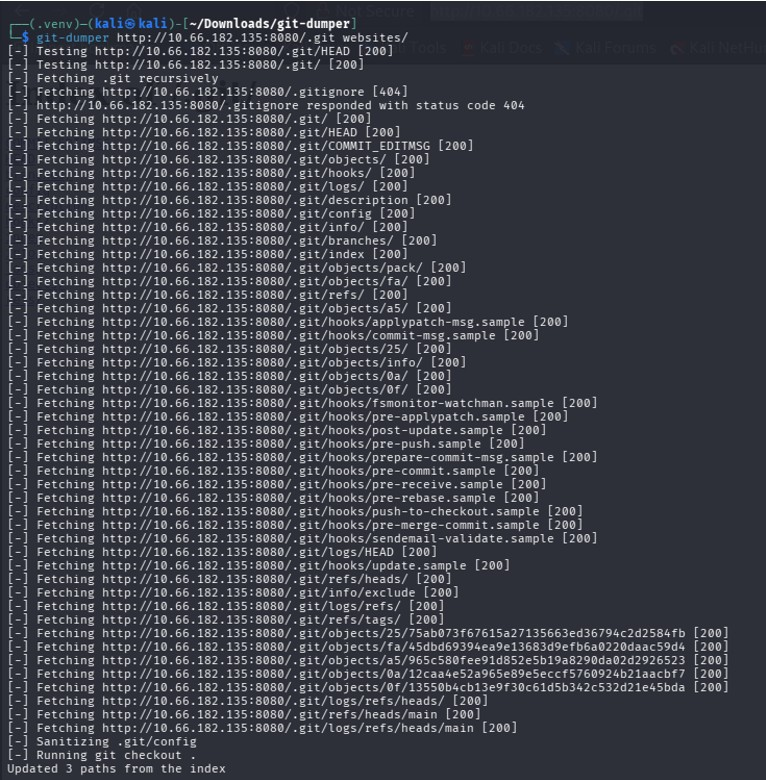
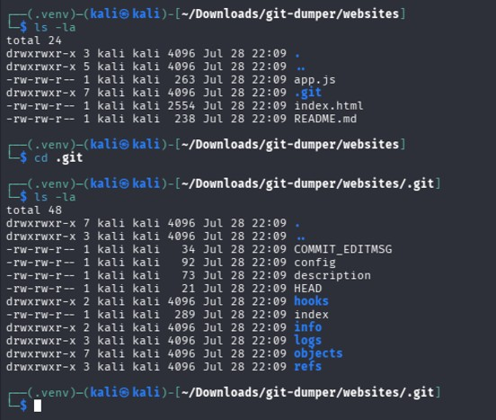
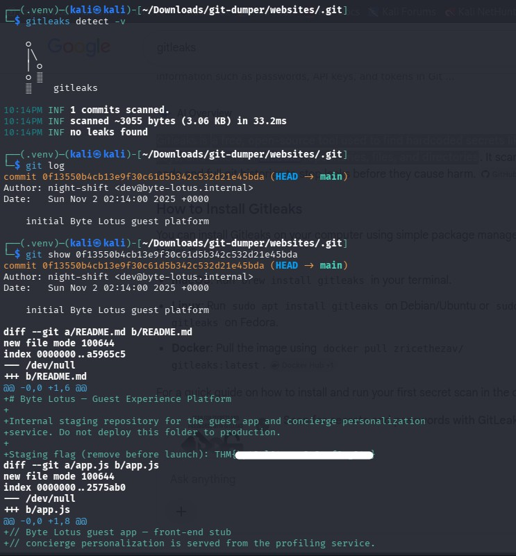

# TryHackMe Hacker Holidays - Room 404

**Event:** Hacker Holidays - Day 2  
**Room:** Room 404  
**Room URL:** https://tryhackme.com/room/hh-room404-804573bf

## Introduction

This challenge focused on web reconnaissance, hidden-directory discovery, exposed Git repository analysis, and secret discovery within Git history.

## Task 1 - Hacker Holidays: Day 2

After starting the machine, I connected to the lab network from Kali Linux using OpenVPN. I first verified that the target system was reachable by sending ICMP echo requests:

```bash
ping -c 4 <TARGET_IP>
```

The target responded successfully, confirming that the VPN connection and communication between the two systems were working correctly.



I opened the Byte Lotus website in a browser by navigating to:

```text
http://<TARGET_IP>:8080
```

The homepage loaded successfully. However, selecting **RESERVE A STAY** returned a `404 Not Found` response. I also tested the other visible navigation links, including **ROOMS**, **THE APP**, **CONCIERGE**, and **STAY**, but they did not provide any useful content.

I reviewed the page source as part of the initial investigation, but it did not reveal any obvious hidden paths, credentials, or flags.



Because the visible links did not lead to useful content, I used **DIRB** to enumerate hidden files and directories on the web server:

```bash
dirb http://<TARGET_IP>:8080
```

DIRB is a command-line web content scanner that uses a wordlist to identify files and directories that may not be linked from the website.

The scan discovered the following accessible Git-related path:

```text
/.git/HEAD
```



I then browsed to the exposed `.git` directory:

```text
http://<TARGET_IP>:8080/.git/
```

Directory listing was enabled, allowing the internal Git repository structure - including objects, references, logs, and configuration files - to be viewed from the web server.



To reconstruct the repository locally, I used the open-source **git-dumper** tool:

```bash
git-dumper http://<TARGET_IP>:8080/.git/ websites/
```

The command downloaded the exposed Git metadata and restored the repository contents inside the `websites` directory.



After the download completed, I listed the recovered files, including hidden files:

```bash
cd websites
ls -la
```

The recovered project included files such as:

```text
app.js
index.html
README.md
.git/
```



I initially used **Gitleaks** to scan the recovered repository:

```bash
gitleaks detect -v
```

Gitleaks is an open-source secret-scanning tool used to identify hardcoded credentials, tokens, API keys, and other sensitive values in repositories.

The scan identified one commit but did not report an active leak in the current working tree. This suggested that the sensitive information might have been removed from the latest version while remaining accessible through the Git commit history.

I reviewed the repository history using:

```bash
git log
```

After identifying the available commit, I inspected its contents with:

```bash
git show <COMMIT_HASH>
```

The commit diff showed that sensitive staging information had previously been added to `README.md`. Although it was no longer present in the current files, it remained recoverable from the Git history and revealed the flag required to complete the challenge.


