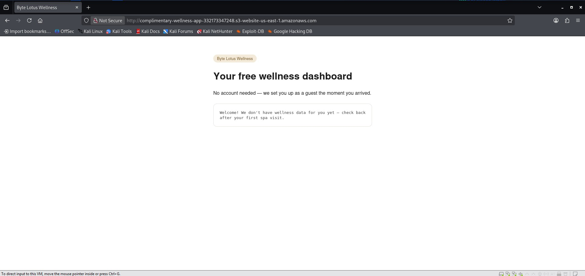
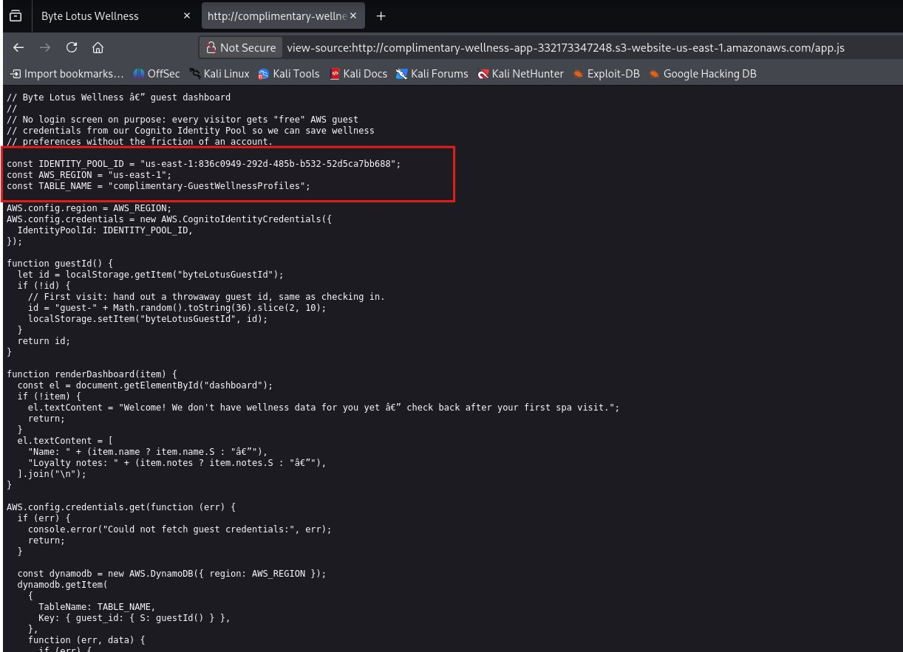
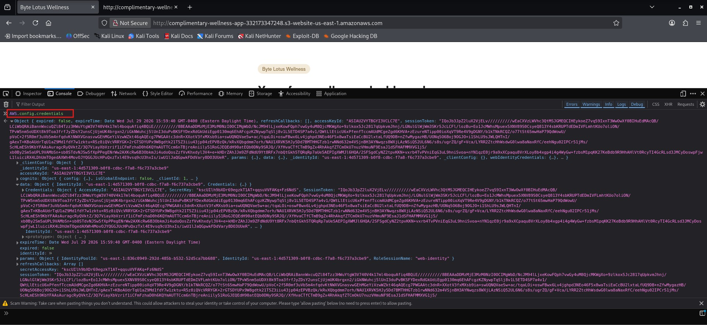
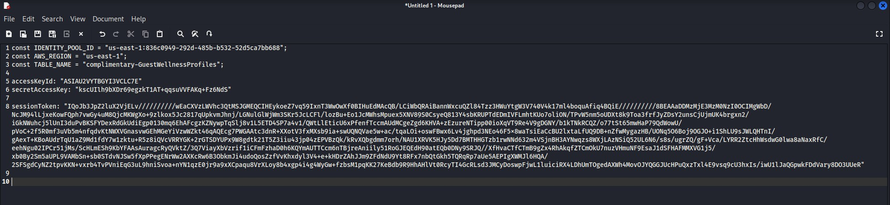
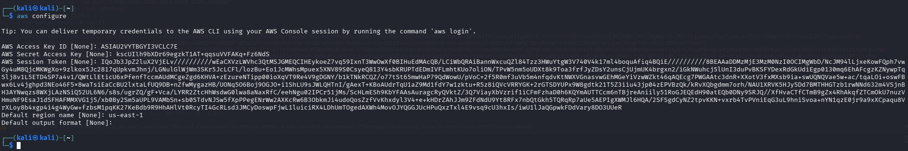
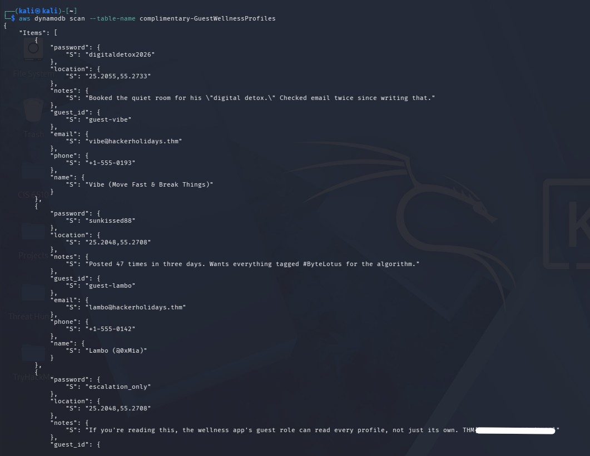

# TryHackMe Hacker Holidays - Day 3
 
**Room:** Complimentary  
**Room URL:** https://tryhackme.com/room/hh-complimentary-05e0b604

## Introduction

This challenge focused on client-side web analysis, AWS Cognito temporary credentials, IAM permissions, and unauthorized access to data stored in Amazon DynamoDB.

## Task 1 - Hacker Holidays: Day 3

I opened the URL provided in the room and reached the Byte Lotus Wellness dashboard. The application displayed a complimentary wellness message but did not reveal any obvious path to the flag through the visible interface.



As part of the initial reconnaissance, I examined the page source and identified a referenced JavaScript file named `app.js`.

Although the main HTML did not contain anything immediately suspicious, reviewing `app.js` revealed several AWS-related configuration values, including:

- `IDENTITY_POOL_ID`
- `AWS_REGION`
- `TABLE_NAME`

The script also showed that the application used `AWS.CognitoIdentityCredentials` to obtain temporary AWS credentials and interacted with a DynamoDB table.



I opened the browser developer console and inspected the AWS credentials object:

```javascript
AWS.config.credentials
```

The object contained temporary credentials issued through Amazon Cognito, including an access key ID, secret access key, and session token.



I recorded the relevant values from the JavaScript source and console output. Sensitive values have been removed from this public write-up.



I configured the AWS CLI in Kali Linux using the temporary credentials and Region obtained from the browser.



The JavaScript source identified the DynamoDB table used by the application. I queried the table using the AWS CLI:

```bash
aws dynamodb scan --table-name complimentary-GuestWellnessProfiles
```

The command returned the guest wellness profiles stored in the table. While reviewing the results, I found a guest record containing the flag.


