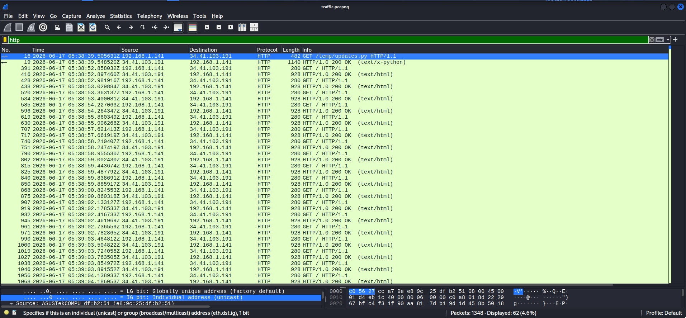
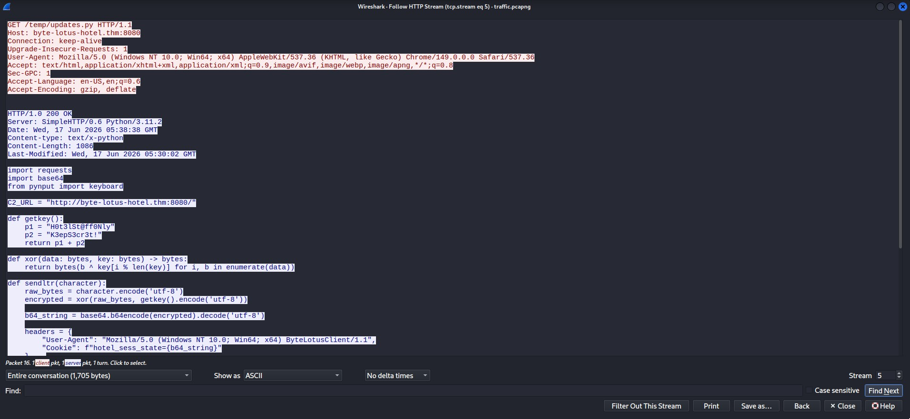
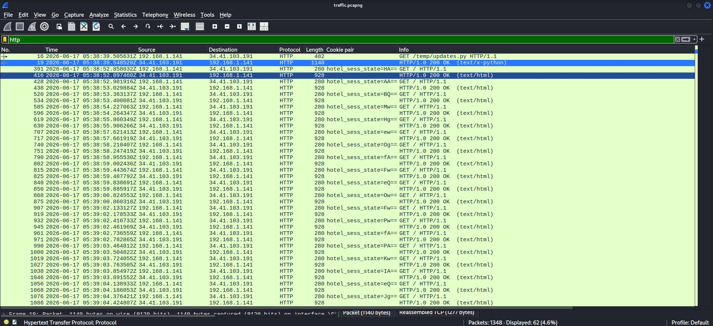
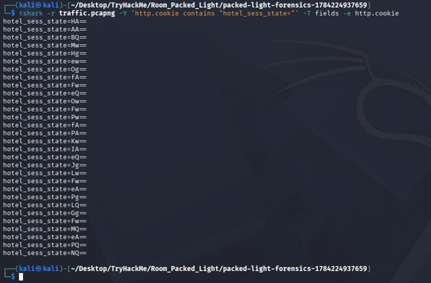
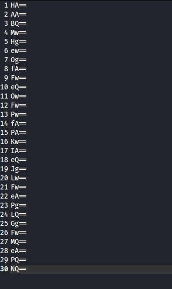
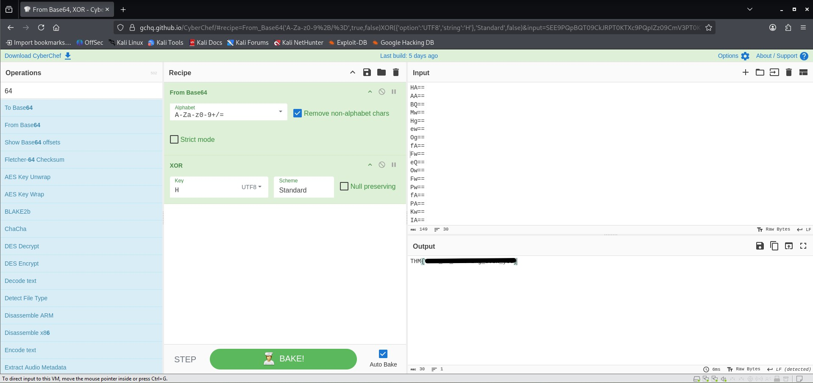

# TryHackMe Hacker Holidays - Day 4
  
**Room:** Packed Light  
**Room URL:** https://tryhackme.com/room/hh-packedlight-02e5330c

## Introduction

This challenge focused on network-forensics analysis using Wireshark, TShark, and CyberChef. The objective was to examine a packet capture, identify suspicious HTTP traffic, understand how captured data was encoded, and reconstruct the information transmitted by the malicious script.

## Task 1 - Hacker Holidays: Day 4

I downloaded the task file provided in the room, which was a PCAPNG network-capture file, and opened it in Wireshark.

The capture contained several protocols, including TCP, HTTP, TLS, and ARP. Because HTTP traffic can expose requested files, headers, cookies, and unencrypted content, I applied the following display filter:

```text
http
```

This reduced the visible traffic to HTTP packets and made the suspicious communication easier to investigate.



One of the first HTTP requests referenced a file named `updates.py`. I right-clicked the packet and selected:

```text
Follow → HTTP Stream
```

The reconstructed stream revealed the contents of a Python script transferred over HTTP.



The script imported `pynput.keyboard`, `requests`, and `base64`, indicating that it was designed to capture keyboard input and transmit data over HTTP.

For every captured character, the script:

1. Converted the character into bytes.
2. XOR-encrypted it using a hardcoded key.
3. Base64-encoded the encrypted byte.
4. Placed the encoded value in an HTTP cookie named `hotel_sess_state`.
5. Sent the cookie to the configured command-and-control server.

Although the script contained a longer XOR key, it processed each keystroke individually. Therefore, the XOR function restarted at the first key byte for every character, meaning each captured character was effectively XORed with `H`.

To make the suspicious cookie data easier to inspect, I added **Cookie Pair** as a custom column in Wireshark. This showed repeated requests containing the `hotel_sess_state` cookie.



I then used TShark to extract the HTTP cookie values directly from the packet capture:

```bash
tshark -r traffic.pcapng \
  -Y 'http.cookie contains "hotel_sess_state="' \
  -T fields \
  -e http.cookie
```

The output contained multiple entries in the following format:

```text
hotel_sess_state=<BASE64_VALUE>
```



I removed the `hotel_sess_state=` prefix so that only the Base64 values remained. One way to perform this step from the command line is:

```bash
tshark -r traffic.pcapng \
  -Y 'http.cookie contains "hotel_sess_state="' \
  -T fields \
  -e http.cookie |
sed 's/^hotel_sess_state=//'
```

This produced an ordered list of the encoded keystrokes.



I copied the Base64 values into CyberChef and applied the following operations:

1. **From Base64**
2. **XOR** using the key `H`

Each cookie represented one captured character, so the decoded characters had to remain in their original packet order. After decoding the complete sequence, the reconstructed text revealed the flag.


