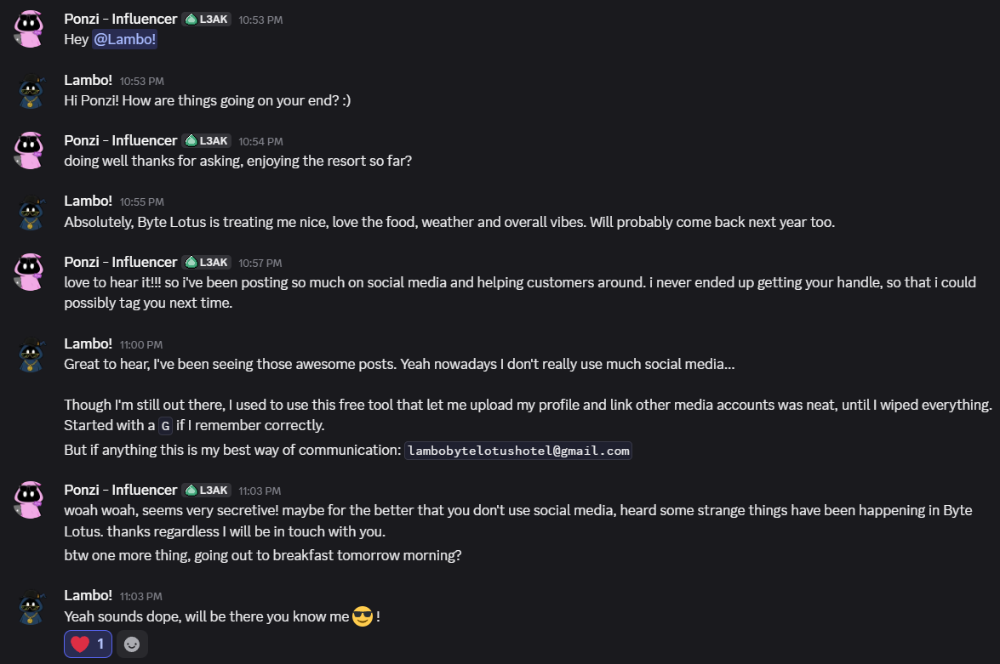
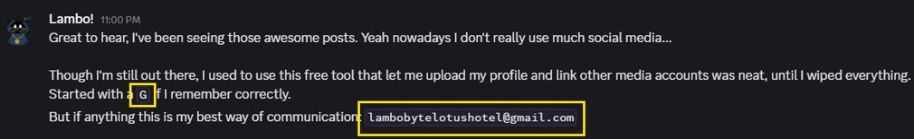
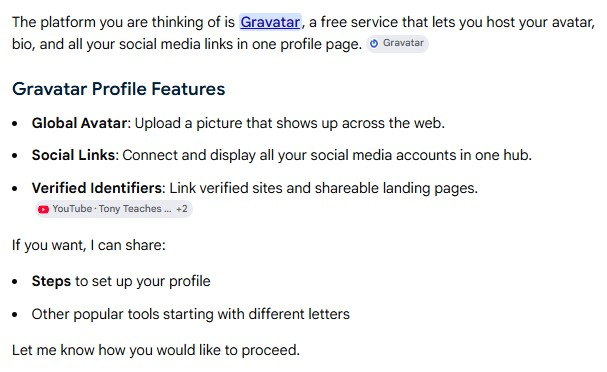
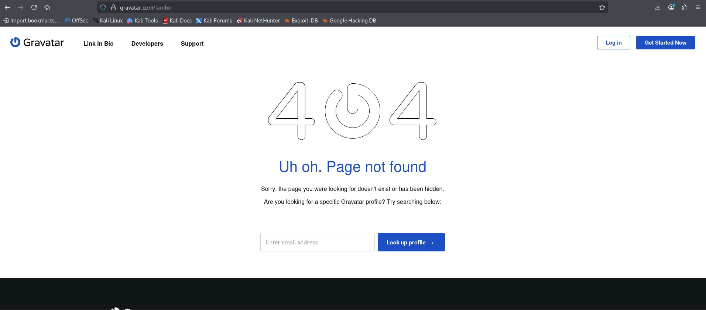
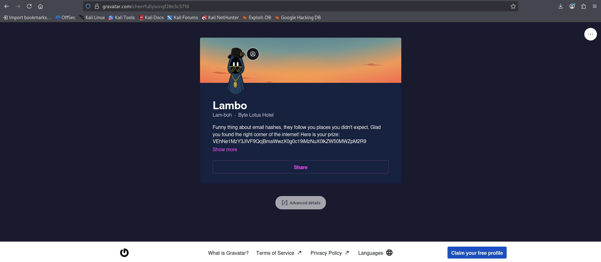
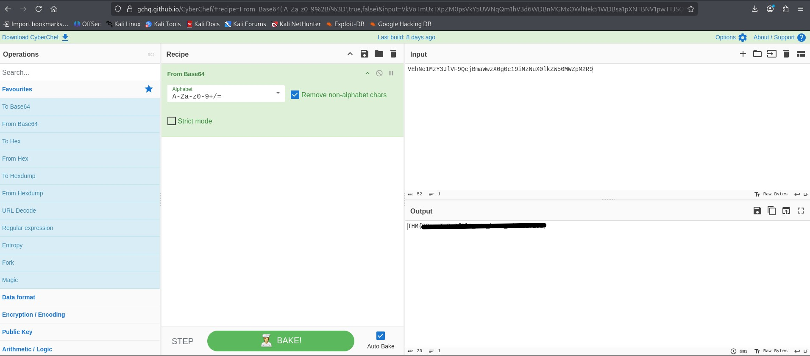

# TryHackMe Hacker Holidays - Day 6

**Room:** Overheard at Breakfast  
**Room URL:** https://tryhackme.com/room/hh-overheardatbreakfast-6f01793c

## Introduction

This challenge focused on Open-Source Intelligence (OSINT), profile discovery, email-based account lookup, and Base64 decoding. The objective was to examine a conversation between two Byte Lotus guests, identify clues about an external profile service, locate the relevant public profile, and decode the hidden flag.

## Task 1 - Hacker Holidays: Day 6

I downloaded the task file provided in the room. It contained a screenshot of a conversation between **Ponzi**, a social media influencer, and **Lambo**.



At first glance, the conversation appeared to be an ordinary discussion between guests at the Byte Lotus. However, a closer review revealed several useful clues.



Lambo mentioned that:

- He had previously used a free online service.
- The service allowed him to upload an avatar.
- It allowed him to link multiple social media accounts in one place.
- The service name began with the letter **G**.
- His preferred contact email was visible in the conversation.

I searched for a free service beginning with **G** that allows users to host an avatar, create a public profile, and link multiple social media accounts.

The description matched **Gravatar**, a service that allows users to associate an avatar and public profile information with an email address.



I first attempted to access a profile by appending `lambo` to the Gravatar URL. This did not locate the expected profile and instead returned a page-not-found response.

The page included a lookup field that accepted an email address, suggesting that an email-based search was the correct approach.



The conversation included Lambo's email address, so I entered it into the Gravatar profile lookup field and selected **Look up profile**.

This successfully located Lambo's public Gravatar profile.



The profile contained a string that appeared to be encoded rather than readable plaintext. Its character set and formatting were consistent with Base64.

I copied the encoded value from the profile and opened CyberChef. I then applied the following operation:

```text
From Base64
```

CyberChef decoded the value and revealed the flag.


