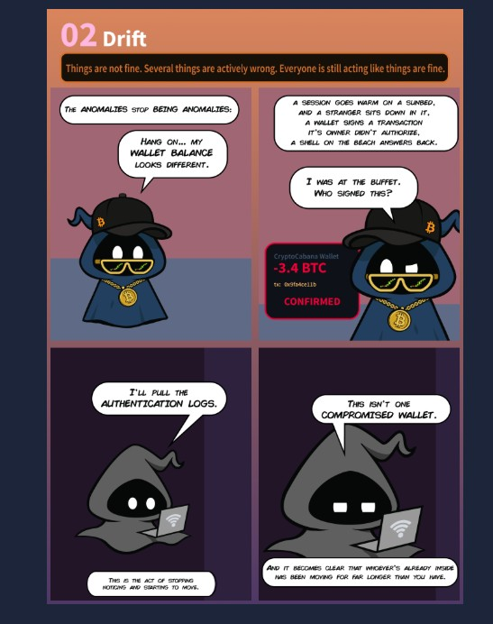
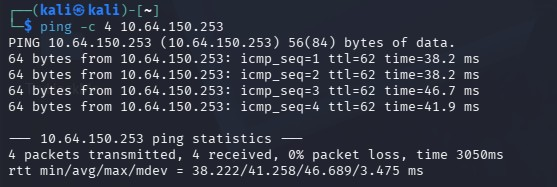
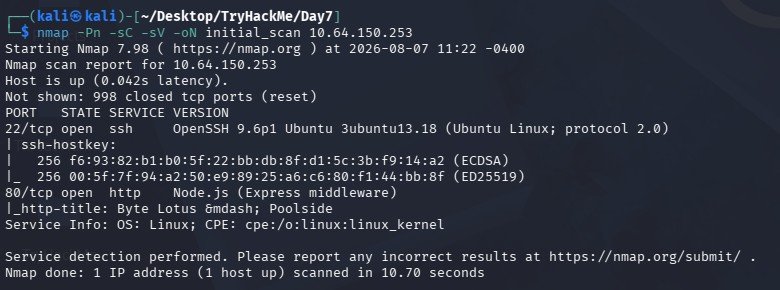
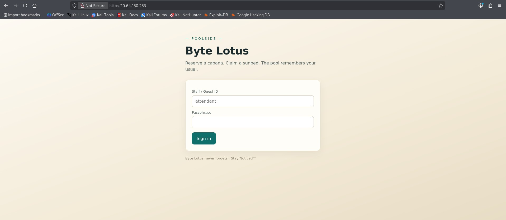
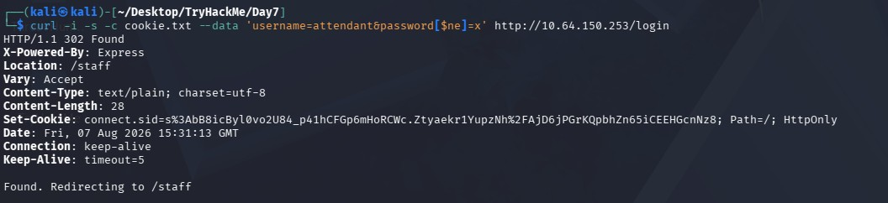
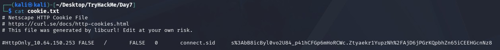
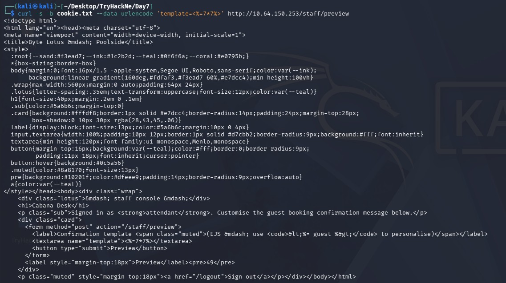
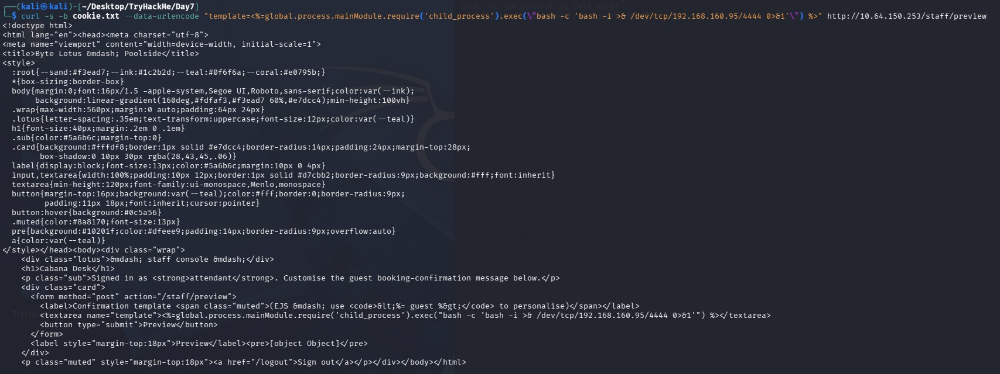
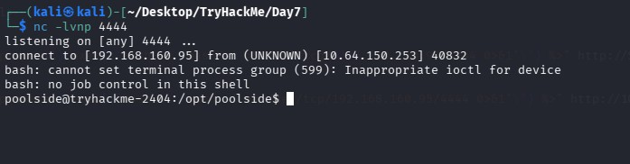
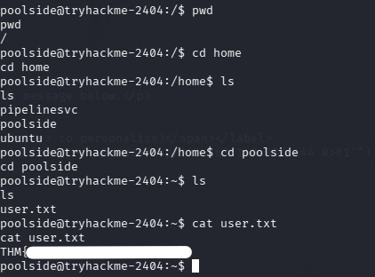

# TryHackMe Hacker Holidays - Day 7

**Room:** Do Not Disturb

**Room URL:** https://tryhackme.com/room/hh-donotdisturb-84a45644

## Introduction

This challenge focused on service enumeration, NoSQL injection to bypass authentication, Server-Side Template Injection (SSTI) leading to remote code execution, reverse shell access, and privilege escalation via an exposed Node.js debug inspector. 

## Task 1 - Hacker Holidays Storyline: Act 2 - Drift



## Task 2 - Hacker Holidays: Day 7

After starting the machine, I connected to the lab network from Kali Linux using OpenVPN. I first verified that the target system was reachable by sending ICMP echo requests.



For service enumeration, I used Nmap to identify open ports, running services, and their versions. The scan showed that SSH was open on port 22, and a "pool side" website was running on port 80 over HTTP, built with Node.js.



I then browsed to the target machine's IP address to see what the "pool side" website looked like.



Since the Nmap results showed the application was running on Node.js, and NoSQL databases such as MongoDB are commonly used with Node.js applications, I attempted a NoSQL injection authentication bypass. I used curl to send a login POST request where the password field was replaced with the MongoDB `$ne` (not equal) operator, attempting to bypass authentication for the `attendant` user without knowing the real password.



The server responded with a `302 Found` redirect to `/staff` and issued a valid session cookie, confirming that the injection worked and the login was bypassed successfully.



With the session cookie obtained, I attempted Server-Side Template Injection (SSTI) — a critical web vulnerability where an attacker injects malicious code into a server-side template. Using the saved session cookie, I sent a POST request containing the EJS payload `<%=7*7%>` to the `/staff/preview` endpoint, testing whether the "guest booking confirmation" template field was vulnerable to SSTI. The page rendered `<pre>49</pre>`, confirming that the `7*7` expression was evaluated server-side and that the application was vulnerable to SSTI, which could potentially be escalated to remote code execution via EJS.



I then attempted to escalate the confirmed SSTI into remote code execution by injecting an EJS payload that used Node's `require("child_process").execSync("id")` (deliberately typo'd as `chile_process` to evade any naive filtering) to run the `id` shell command on the server. The command output showed `uid=996(poolside) gid=996(poolside) groups=996(poolside)`, confirming that the injected `id` command executed successfully on the server. This confirmed full remote code execution, running as the low-privileged `poolside` system user.


I opened another terminal and started a netcat listener, then triggered the remote shell execution from the first terminal. Using the SSTI vulnerability, I executed a bash reverse shell payload via `child_process.exec()`, connecting back to my attacking machine (`192.168.160.95`) on port `4444`. An `nc -lvnp 4444` listener caught the incoming connection, granting an interactive shell as the `poolside` user on the target and confirming full remote shell access to the box.





After getting reverse shell access, I changed directory and found a file named `user.txt`, which revealed the user flag.



Next, I ran three recon commands to check for an exposed Node.js debugger: checking whether port `9229` was listening, confirming a process was running with the `--inspect` flag, and querying the inspector's JSON metadata endpoint for debugger connection info.

```bash
ss -tlnp | grep 9229
ps -ef | grep inspect
curl http://127.0.0.1:9929/json
```

*(Forgot to capture the screenshot for this step.)*

The output confirmed that a second Node process (`processor.js`) was running as a different, higher-privileged user (`pipeline+`), with an unauthenticated debug inspector listening on `127.0.0.1:9229`. This returned the `webSocketDebuggerUrl` needed to connect to and hijack that process for further code execution and privilege escalation.

I then opened another terminal, started a netcat listener the same way as before, and triggered a reverse shell from the existing session:

```bash
nc -lvnp 4445
```

*(Forgot to capture the screenshot for this step.)*

This granted a shell as the higher-privileged `pipeline+` user via the hijacked debugger process, which revealed the root flag.
