# TryHackMe Hacker Holidays - Day 8

**Room:** Towel on the Sunbed
**Room URL:** https://tryhackme.com/room/hh-towelonthesunbed-61271709

## Introduction

This challenge focused on web application logic flaws, client-side control tampering, and race condition exploitation using Burp Suite's Repeater. The objective was to bypass a client-side reward cooldown, then abuse a race condition in the reward-claiming endpoint to accumulate enough balance to unlock a vault and reveal the flag.

## Task 1 - Hacker Holidays: Day 8

After starting the TryHackMe machine, I connected to the lab network from Kali Linux using OpenVPN. I first verified that the target system was reachable.

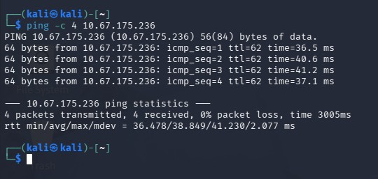

I accessed the URL provided in the room, which loaded the challenge's landing page.

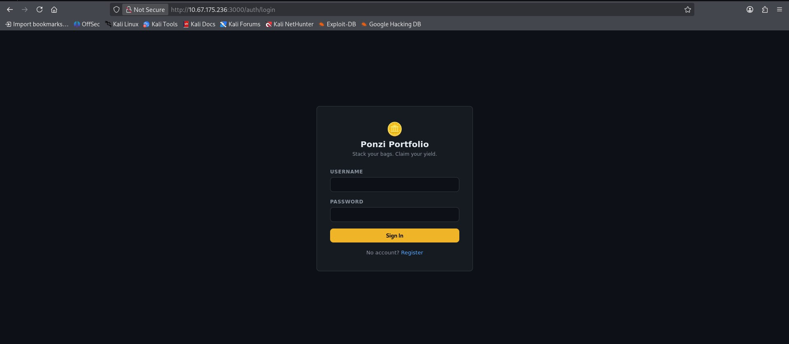

As mentioned in the room's itinerary, I created a guest account by clicking the register link, using the username `aaaa` and password `123456`. After registering, the webpage displayed a dashboard with a **Claim Reward** button.

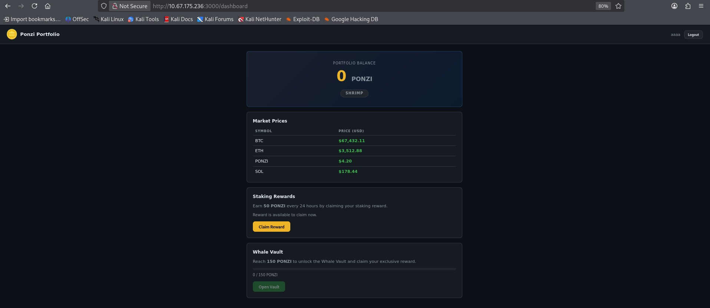

I clicked **Claim Reward** to claim the reward, and the balance updated from `0` to `50`. The button then became disabled, indicating that another claim would not be possible for 24 hours.

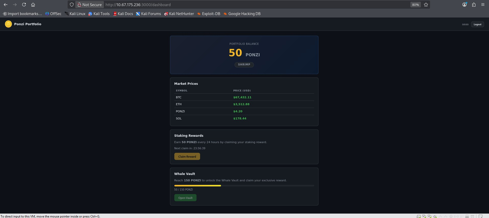

To get around the 24-hour cooldown on the client side, I inspected the **Claim Reward** button's element in the browser DevTools and edited the DOM to change its `disabled` attribute so the button became clickable again.

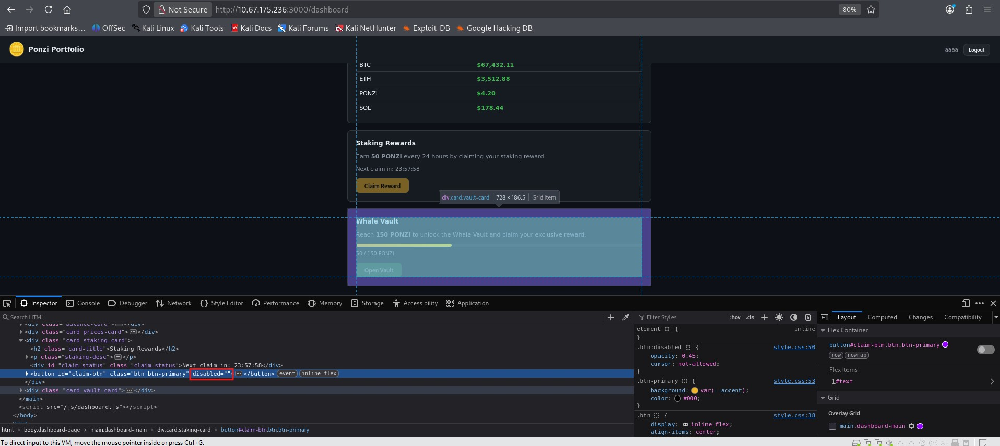

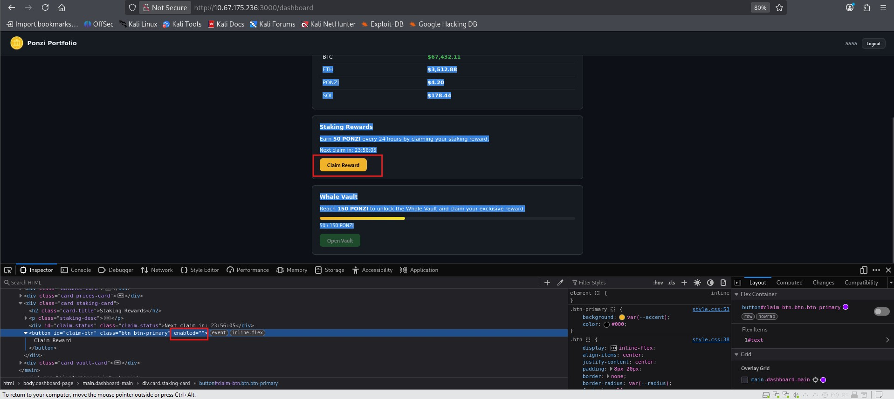

With the button re-enabled, I started Burp Suite and turned on proxy interception before clicking **Claim Reward** again. The claim request was successfully intercepted in Burp Suite.

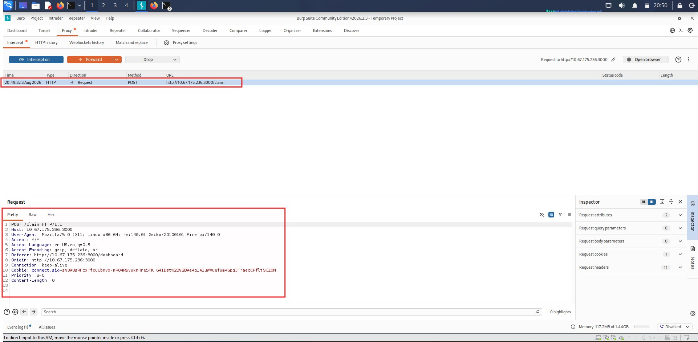

I sent the intercepted request to Repeater three times, giving me three identical copies of the request queued up.

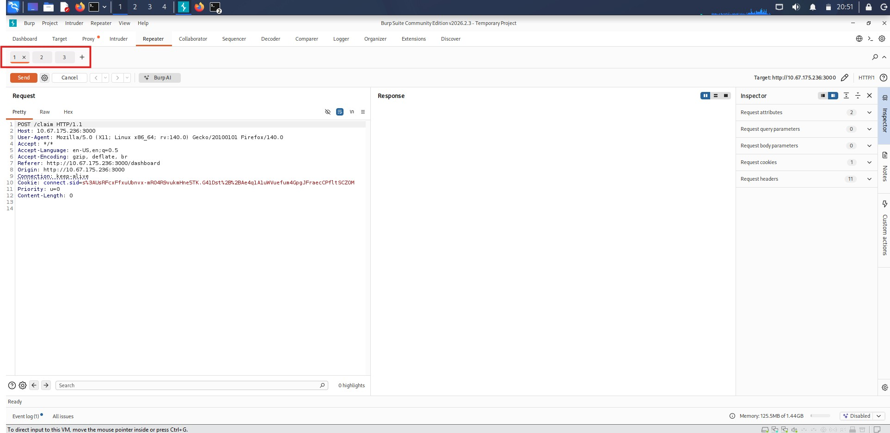

I grouped all three requests together and used the **Send group in parallel (last-byte sync)** option to fire them at the server simultaneously, aiming to trigger a race condition on the reward endpoint.

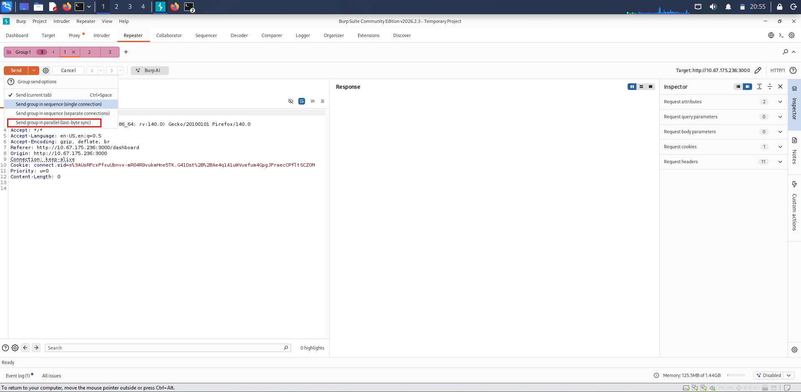

The requests were sent successfully, but because I had already tampered with the UI state (re-enabling the disabled button), the server responded with an error rather than processing the claims.

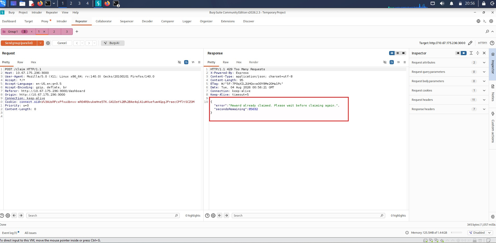

To rule out the DOM edit as the cause of the error, I created a fresh account with username `ssss` and password `123456`. This time, without modifying anything in the UI, I intercepted the natural request generated by clicking **Claim Reward**, sent it to Repeater three times, grouped the three requests, and again chose **Send group in parallel (last-byte sync)**. This attempt did not return an error - instead, the response confirmed that the staking reward had been claimed successfully, for each of the three requests, due to the race condition in how the server validated and processed concurrent claims.

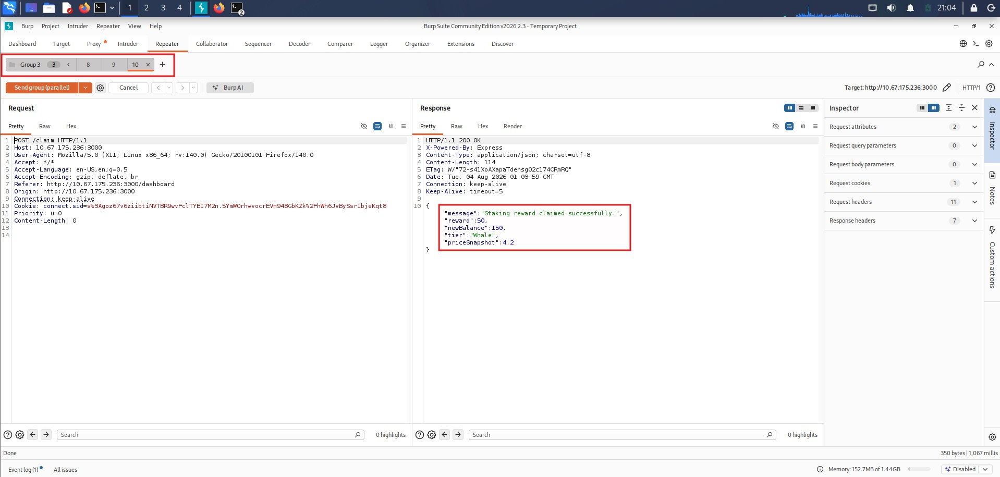

I turned off proxy interception and refreshed the page. With the inflated balance from the race condition, the **Open Vault** button was now enabled. Clicking it revealed the flag.

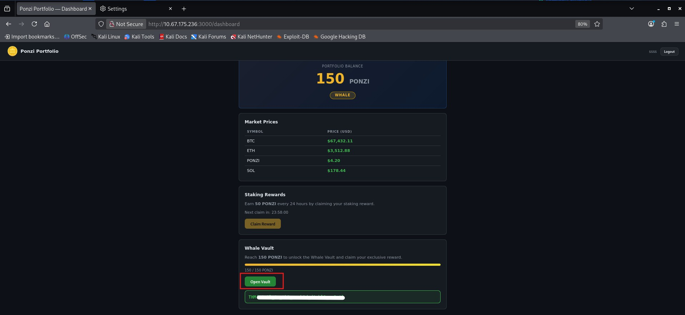
